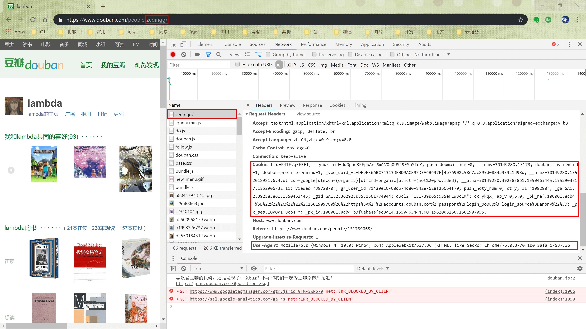
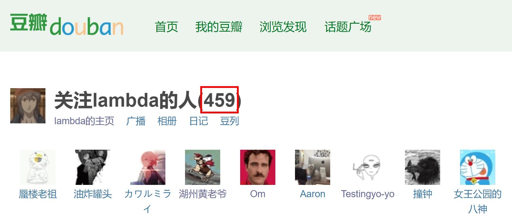
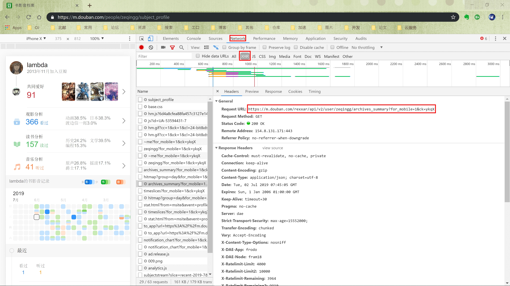
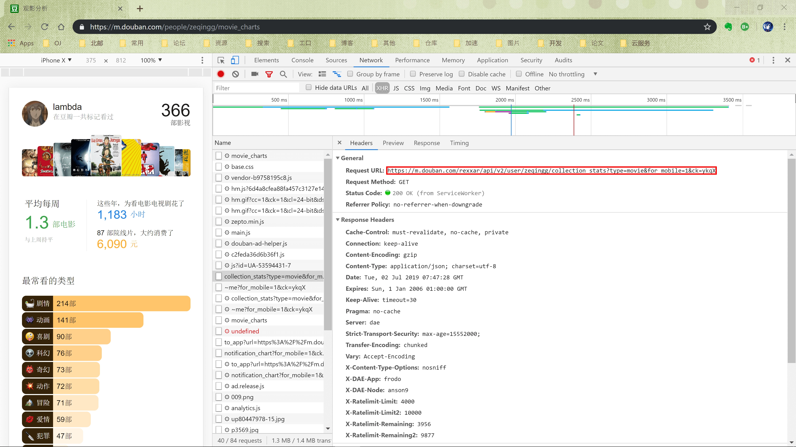
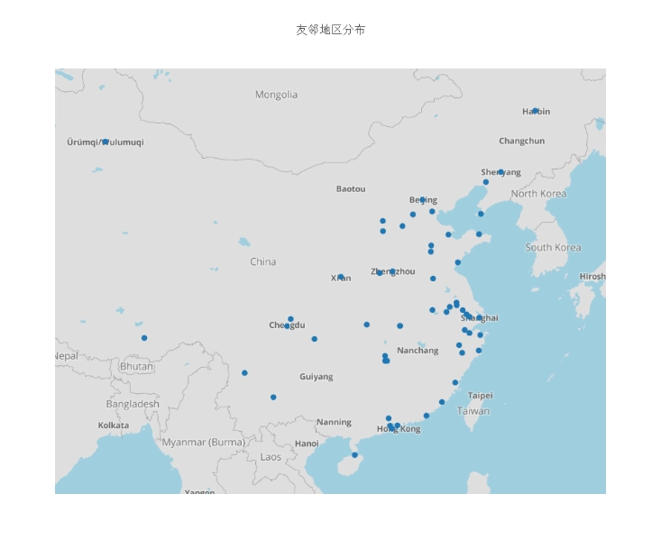
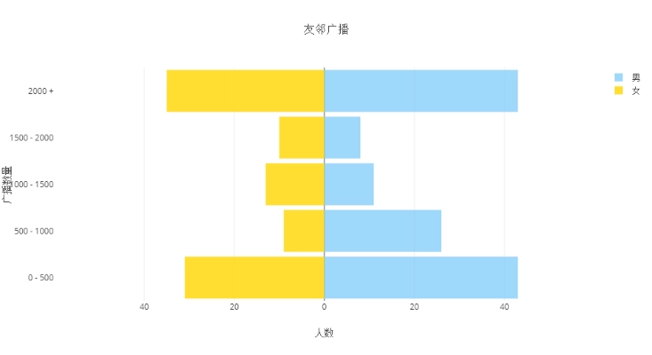
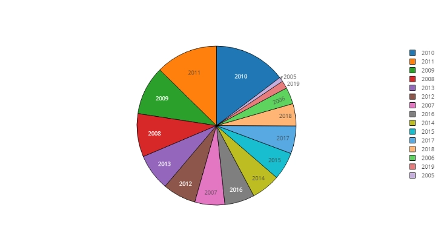
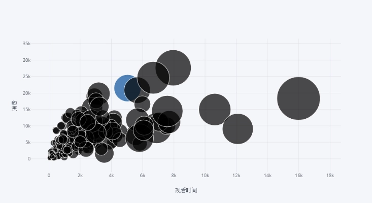
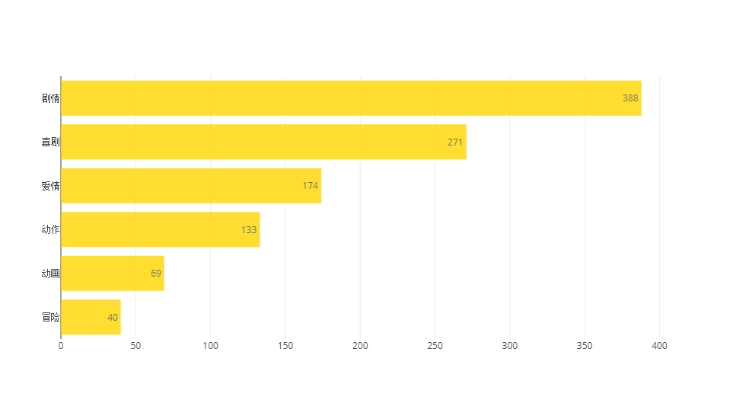
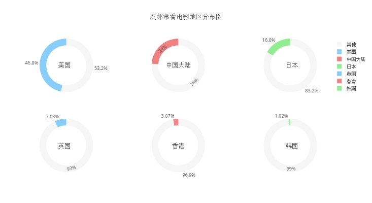

+++
title = "Douban Neighbor Analysis"
subtitle = ""
summary = "Using python crawler to analyze Douban neighbor data"

date = 2019-08-19T12:21:58+08:00
draft = false

authors = ["YXL"]

featured = false

tags = ["Crawler"]
categories = ["Network"]

[image]
  caption = ""
  focal_point = ""
  preview_only = true

[header]
  image = "【初恋】「saberiii 」[pid=39758588].webp"  
  caption = "Image credit: [**saberiii**](https://www.pixiv.net/member_illust.php?mode=medium&illust_id=39758588)"
+++

[](https://app.netlify.com/sites/yxl/deploys)

{}
If the display on the mobile phone is abnormal, please turn off the night mode in the menu bar.
{}

<div id="progress-left"></div>
<div id="progress-right"></div>

<link rel="stylesheet" href="../../../css/noto-sans-sc.css">
<link rel="stylesheet" href="../../../css/APlayer.min.css">
<script src="../../../js/APlayer.min.js"></script>
<script src="../../../js/Meting.js"></script>

<meting-js
	server = "netease"
	type = "song"
	id = "18137221"
	fixed= false
	mini= false
	autoplay = true
	preload = 'auto'
	volume = 0.8>
</meting-js>


<h2> Table of Contents </h2>

---

1. [Introduction](#Introduction)
2. [Data Collection](#Data-Collection)
  1. [Simulated user login](#Simulated-user-login)
  2. [Get the target user neighbor list](#Get-the-target-user-neighbor-list)
  3. [Get neighbor data](#Get-neighbor-data)
3. [Data Analysis](#Data-Analysis)
  1. [Draw a map of neighboring distribution](#Draw-a-map-of-neighboring-distribution)
  2. [Draw a picture of your neighbors](#Draw-a-picture-of-your-neighbors)
  3. [Draw registration time chart](#Draw-registration-time-chart)
  4. [Drawing a viewing data graph](#Drawing-a-viewing-data-graph)
  5. [Draw a neighboring movie type distribution map](#Draw-a-neighboring-movie-type-distribution-map)
  6. [Draw a map of the neighborhood of the movie](#Draw-a-map-of-the-neighborhood-of-the-movie)
4. [Summary](#Summary)

<h2 id='Introduction'> Introduction </h2>

---

This is one of my python crawler practice projects. This project will crawl and retrieve relevant data based on a user's friendly neighbors to generate a corresponding portrait of the Douban.

<h2 id='Data-Collection'> Data Collection </h2>

---

<h3 id='Simulated-user-login'> Simulated user login </h3>

Take [https://www.douban.com/people/zeqingg/rev_contacts] (https://www.douban.com/people/zeqingg/rev_contacts) as an example. This page will show all the friends of the target users. The `zeqingg` is the `uid` of the target user.

However, it should be noted that the access to the page must be registered to the Douban account, otherwise it will jump to the login page, resulting in the failure of the page.

Now log in to your own Douban account in the browser (as in Google Chrome) and go to this page. Use the `network` tool in `Developer tools` to get the `Cookie` and `User-Agent` sent to the server (see below) Figure). In the `python` program, use `requests` to add a `Cookie` when sending a request, simulate login, join U`ser-Agent` to simulate browser access, prevent being intercepted, and get the static file of the target page.



``` python
import requests
from bs4 import BeautifulSoup

from settings import user_agent
from settings import cookie
from settings import target_user

session = requests.Session()

url = 'https://www.douban.com/people/' + target_user + '/rev_contacts'
headers = {
    'User-Agent': user_agent,
    'Cookie': cookie,
}

response = session.get(url=url, headers=headers)
if response.status_code != 200:
    print('fail，please check cookie and uid')
soup = BeautifulSoup(response.text, 'lxml')
# print(soup)
print('success')

```

The resulting `Cookie` is not permanent and cannot be used all the time. If `Cookie` is invalid, you will need to log in again to get a new `cookie`.

<h3 id='Get-the-target-user-neighbor-list'> Get the target user neighbor list </h3>

It can be found that each page can only display at most `70` friends, and the starting neighbors of the display are specified by the `start` value set in the `parameter` of the request. Therefore, you must first obtain the number of all neighbors of the target user.

Through the analysis of multiple web pages, it is found that the number of friends per user is displayed in a fixed place (as shown below), and the corresponding `css selector` is `#db-usr-profile > div.info > h1`. Use `BeautifulSoup` to parse the previously obtained web page, use the `select` function to extract the part and get the number of friends.



``` python
# Get the total number of friends of the user from the crawled page

# css selector
num = soup.select('#db-usr-profile > div.info > h1')
num = BeautifulSoup(str(num[0]), 'lxml').string
# Numbers start from the penultimate character
length = len(num) - 2
while '0' <= num[length] <= '9':
    length -= 1
num = int(num[length + 1:len(num) - 1])
print(num)

```

Once you have a number of friends, you can iterate through all the pages. For each page, each friend has a link to their own home page. The ` css selector` for the `url` of the home page is `#content > div > div.article > dl > dt > a`. Each url can be easily extracted from the form of [https://www.douban.com/people/zeqingg/] (https://www.douban.com/people/zeqingg/).

``` python
# Crawl all the neighbor list pages, get the uid of all the neighbors, save to local

from settings import uid_file

with open(uid_file, 'w') as file:
    # Display up to 70 neighbors per page
    for i in range(0, num, 70):
        current_url = url + '?start=' + str(i)
        # print(current_url)
        response = session.get(url=current_url, headers=headers)
        soup = BeautifulSoup(response.text, 'lxml')
        peoples = soup.select('#content > div > div.article > dl > dt > a')
        for people in peoples:
            uid = (BeautifulSoup(str(people), 'lxml').a['href'])[30:-1]
            print(uid)
            file.write(uid + '\n')

```

<h3 id='Get-neighbor-data'> Get neighbor data </h3>

Each user's home page has its corresponding data, but considering its complicated page structure, it is more complicated to process, and the data content is less, so it is not used.

The Douban mobile version of the book video file page has more detailed information, which can support more in-depth data analysis.

Take [https://m.douban.com/people/zeqingg/subject_profile] (https://m.douban.com/people/zeqingg/subject_profile) as an example. There is a lot of information available for analysis. However, after obtaining the webpage, I found that there was no data I saw.

After analysis, it is found that the webpage is a dynamic webpage, and all the data is requested after the webpage is opened. Using the `network` tool in `Developer tools` again, look at the items in the `XHR` category and get the request for the real `url` for [https://m.douban.com/rexxar/api/v2/user/ Zeqingg/archives_summary?for_mobile=1&ck=ykqX](https://m.douban.com/rexxar/api/v2/user/zeqingg/archives_summary?for_mobile=1&ck=ykqX) (as shown below). Requesting this link does not require a mock login. At the same time, the returned data is in the `json` format, parsed using the `loads()` function of the `json` module in `python`.



What is needed is the account information. The `json` data corresponds to the `user` item, which has many useful data items, such as birthday `birthday`, gender `gender`, resident `loc`, registration time `reg_time`. , broadcast number `statuses_count` and so on. We all save it to a `csv` file.

What can't be ignored is that some users do not fill in or are unwilling to disclose. There is no corresponding data in `json`. To prevent the `python` program from reporting errors, use the `try` statement, and if it doesn't exist, write an empty string.

The acquisition of the viewing information is the same as the acquisition of the account information, using the mobile phone's web page [https://m.douban.com/people/zeqingg/movie_charts] (https://m.douban.com/people/zeqingg/movie_charts) For example. This page is also a dynamic page, using the same method as the previous step. After analyzing, the url of the real request is [https://m.douban.com/rexxar/api/v2/user/zeqingg/collection_stats?type= Movie&for_mobile=1&ck=ykqX](https://m.douban.com/rexxar/api/v2/user/zeqingg/collection_stats?type=movie&for_mobile=1&ck=ykqX) (as shown below).



Useful data in the returned `json` data such as the viewing number `total_collections`, the time to watch the movie 'total_spent`, the consumption in the cinema `total_cost`, the average weekly viewing time `weekly_avg`, most often watched The area `countries`, the most commonly watched type `genres` and so on. Again, write them to the `csv` file.

It should be noted that the watercress has an anti-reptile mechanism and has a limit on the number of visits per unit time. If you make a lot of visits in a short time, you will be blocked. So, use the `sleep`) function of the `time` module in `python` to add a delay of `2` seconds after each request, avoiding the possibility of being intercepted.

``` python
from json import loads


def get_movie_info(nuid=''):
    nurl = 'https://m.douban.com/rexxar/api/v2/user/' + nuid + '/collection_stats?type=movie&for_mobile=1&ck=5Kvd'
    nreferer = 'https://m.douban.com/people/' + nuid + '/movie_charts'
    nheaders = {
        'Referer': nreferer,
        'User-Agent': user_agent,
    }
    nresponse = session.get(url=nurl, headers=nheaders)
    # The returned data is in json format, parsed using loads
    ndecoded = loads(nresponse.text)
    # print(decoded)
    nrow = []
    # Number of views
    try:
        nrow.append(ndecoded['total_collections'])
    except:
        nrow.append('')
    # Watch time
    try:
        nrow.append(int(ndecoded['total_spent']))
    except:
        nrow.append('')
    # Consumption
    try:
        nrow.append(int(ndecoded['total_cost']))
    except:
        nrow.append('')
    # Average weekly viewing time
    try:
        nrow.append(round(ndecoded['weekly_avg'], 1))
    except:
        nrow.append('')
    # The following two are the most frequently viewed areas
    try:
        nrow.append(ndecoded['countries'][0]['name'])
    except:
        nrow.append('')
    try:
        nrow.append(ndecoded['countries'][1]['name'])
    except:
        nrow.append('')
    # The following three items are the most common viewing types
    try:
        nrow.append(ndecoded['genres'][0]['name'])
    except:
        nrow.append('')
    try:
        nrow.append(ndecoded['genres'][1]['name'])
    except:
        nrow.append('')
    try:
        nrow.append(ndecoded['genres'][2]['name'])
    except:
        nrow.append('')
    # print(row)
    return nrow


def get_user_info(nuid=''):
    nurl = 'https://m.douban.com/rexxar/api/v2/user/' + nuid + '/archives_summary?for_mobile=1&ck=5Kvd'
    nreferer = 'https://m.douban.com/people/' + nuid + '/subject_profile'
    nheaders = {
        'Referer': nreferer,
        'User-Agent': user_agent,
    }
    nresponse = session.get(url=nurl, headers=nheaders)
    # The returned data is in json format, parsed using loads
    ndecoded = loads(nresponse.text)
    # print(decoded)
    nrow = []
    # User's location
    try:
        nrow.append(ndecoded['user']['loc']['name'])
    except:
        nrow.append('')
    # User broadcast number
    try:
        nrow.append(ndecoded['user']['statuses_count'])
    except:
        nrow.append('')
    # User registration time
    try:
        nrow.append(ndecoded['user']['reg_time'][:4])
    except:
        nrow.append('')
    # User gender
    try:
        nrow.append(ndecoded['user']['gender'])
    except:
        nrow.append('')
    # print(row)
    return nrow


def get_info(nuid=''):
    nrow = []
    nrow += get_user_info(nuid)
    nrow += get_movie_info(nuid)
    print(nrow)
    return nrow


import csv
from time import sleep

from settings import csv_title
from settings import dataset_file

with open(uid_file) as infile:
    with open(dataset_file, 'w', encoding='utf-8', newline='') as outfile:
        csv_file = csv.writer(outfile, dialect='excel')
        csv_file.writerow(csv_title)
        for line in infile:
            uid = line[:-1]
            # print(uid)
            csv_file.writerow(get_info(uid))
            sleep(2)

```

<h2 id='Data-Analysis'> Data Analysis </h2>

---

The data visualization for this section will use `Plotly` as an example, and the version of `pyecharts` will be used in the code I gave.

<h3 id='Draw-a-map-of-neighboring-distribution'> Draw a map of neighboring distribution </h3>

``` python
from settings import loc_lat
from settings import loc_lon
from settings import mapbox_access_token

loc = []
num = []
lat = []
lon = []

with open(dataset_file, 'r', encoding='utf-8') as file:
    csv_file = csv.reader(file)
    for line in csv_file:
        # Blank line (user has logged out), no data, header line
        if len(line) == 0 or line[0] == '' or line == csv_title:
            continue
        # No latitude and longitude data
        if loc_lat.get(line[0]) is None:
            continue
        try:
            # If this region has been added to the loc array
            index = loc.index(line[0])
            num[index] += 1
        except ValueError:
            # Join a new area
            loc.append(line[0])
            num.append(1)
            lat.append(loc_lat[line[0]])
            lon.append(loc_lon[line[0]])

# print(loc)
# print(num)            

# Text displayed when hovering
text = []
for i in range(len(loc)):
    text.append(str(loc[i]) + '   ' + str(num[i]))

data = [
    go.Scattermapbox(
        lat=lat,
        lon=lon,
        mode='markers',
        marker=go.scattermapbox.Marker(
            # The size of the logo
            size=9
        ),
        text=text,
    )
]

layout = go.Layout(
    autosize=True,
    hovermode='closest',
    height=800,
    title='友邻地区分布',
    mapbox=go.layout.Mapbox(
        # Must have the correct access token to use
        accesstoken=mapbox_access_token,
        bearing=0,
        center=go.layout.mapbox.Center(
            lat=34,
            lon=108
        ),
        pitch=0,
        zoom=3.5,
    ),
)

fig = go.Figure(data=data, layout=layout)
py.iplot(fig, filename='neighbor_distribution_map')


```



<h3 id='Draw-a-picture-of-your-neighbors'> Draw a picture of your neighbors </h3>

``` python
from math import ceil
from bisect import bisect_left

from settings import status_range

# Number of male
male_status_num = np.array(list(0 for _ in status_range))
# Number of female
female_status_num = np.array(list(0 for _ in status_range))

with open(dataset_file, 'r', encoding='utf-8') as file:
    csv_file = csv.reader(file)
    for line in csv_file:
        # Blank line (user has logged out), no data, header line
        if len(line) == 0 or line[1] == '' or line == csv_title:
            continue
        # The neighbor is a male
        if line[3] == 'M':
            # Query which interval the number of broadcasts of the friend is in
            index = bisect_left(status_range, int(line[1]))
            male_status_num[index - 1] += 1
        # The neighbor is a female
        elif line[3] == 'F':
            index = bisect_left(status_range, int(line[1]))
            female_status_num[index - 1] -= 1

# print(male_status_num)
# print(female_status_num)

# Maximum number of people
length = max(max(male_status_num), -max(female_status_num))
# print(length)

# The x-axis boundary is set to a multiple of 30
boundary = 30 * ceil(length / 30)
# print(boundary)

# The interval displayed by the y-axis
label = []
for index in range(1, len(status_range)):
    label.append('{} - {}'.format(str(status_range[index - 1]), str(status_range[index])))
label.append(str(status_range[-1]) + ' +')
# print(label)

layout = go.Layout(title='友邻广播',
                   yaxis=go.layout.YAxis(title='广播数量'),
                   xaxis=go.layout.XAxis(
                       range=[-boundary, boundary],
                       # Numerical value when drawing
                       tickvals=list(val for val in range(20 - boundary, boundary, 20)),
                       # Value when displayed (positive value)
                       ticktext=list(abs(text) for text in range(20 - boundary, boundary, 20)),
                       title='人数'),
                   barmode='overlay',
                   bargap=0.1)

data = [go.Bar(y=label,
               x=male_status_num,
               orientation='h',
               name='男',
               hoverinfo='x',
               marker=dict(color='lightskyblue'),
               opacity=0.8
               ),
        go.Bar(y=label,
               x=female_status_num,
               orientation='h',
               name='女',
               text=-1 * female_status_num.astype('int'),
               hoverinfo='text',
               marker=dict(color='gold'),
               opacity=0.8
               )]

py.iplot(dict(data=data, layout=layout), filename='status_pyramid_chart')

```



<h3 id='Draw-registration-time-chart'> Draw registration time chart </h3>

``` python
from settings import reg_year_range

reg_year_num = np.array(list(0 for _ in reg_year_range))

with open(dataset_file, 'r', encoding='utf-8') as file:
    csv_file = csv.reader(file)
    for line in csv_file:
        # Blank line (user has logged out), no data, header line
        if len(line) == 0 or line[2] == '' or line == csv_title:
            continue
        reg_year_num[reg_year_range.index(int(line[2]))] += 1

# print(reg_year_num)

trace = go.Pie(
    labels=reg_year_range,
    values=reg_year_num,
    textinfo='label',
    marker=dict(line=dict(color='black', width=1))
)

py.iplot([trace], filename='reg_year_pie_chart')

```



<h3 id='Drawing-a-viewing-data-graph'> Drawing a viewing data graph </h3>

``` python
import cufflinks as cf
import pandas as pd

cf.set_config_file(offline=False, world_readable=True)

df = pd.read_csv(dataset_file).dropna()

# x axis：Watch time
# y axis：Consumption
# size：Number of views
df.iplot(kind='bubble', x=csv_title[5], y=csv_title[6], size=csv_title[4], text=csv_title[4],
         xTitle='观看时间', yTitle='消费', colorscale='blues', filename='movie_bubble_chart')

```



<h3 id='Draw-a-neighboring-movie-type-distribution-map'> Draw a neighboring movie type distribution-map </h3>

``` python
from settings import genre_range

genre_num = np.array(list(0 for _ in genre_range))

with open(dataset_file, 'r', encoding='utf-8') as file:
    csv_file = csv.reader(file)
    for line in csv_file:
        # Blank line (user has logged out), header line
        if len(line) == 0 or line == csv_title:
            continue
        # Read the three types most viewed by each neighbor
        if line[10] != '':
            genre_num[genre_range.index(line[10])] += 1
        if line[11] != '':
            genre_num[genre_range.index(line[11])] += 1
        if line[12] != '':
            genre_num[genre_range.index(line[12])] += 1

# print(genre_num)
            
num = []
label = []
# Filter out the six types most common to all your friends
for i in range(6):
    index = np.argmax(genre_num)
    label.append(genre_range[index])
    num.append(genre_num[index])
    genre_num[index] = 0

num.reverse()
label.reverse()

# print(num)
# print(label)

data = [go.Bar(
    x=num,
    y=label,
    text=num,
    textposition='auto',
    orientation='h',
    marker=dict(color='gold'),
    opacity=0.8
)]

py.iplot(data, filename='genre_horizontal_bar_chart')

```



<h3 id='Draw-a-map-of-the-neighborhood-of-the-movie'> Draw a map of the neighborhood of the movie </h3>

``` python
from settings import country_range

total = 0
country_num = np.array(list(0 for _ in country_range))

with open(dataset_file, 'r', encoding='utf-8') as file:
    csv_file = csv.reader(file)
    for line in csv_file:
        # Blank line (user has logged out), header line
        if len(line) == 0 or line == csv_title:
            continue
        # Read the two most visited areas of each neighborhood
        if line[8] != '':
            country_num[country_range.index(line[8])] += 1
            total += 1
        if line[9] != '':
            country_num[country_range.index(line[9])] += 1
            total += 1

# print(country_num)

# Pie chart's x coordinate
domain_x = ([0, 0.24], [0.38, 0.62], [0.76, 1], [0, 0.24], [0.38, 0.62], [0.76, 1])
# Pie chart's y coordinate
domain_y = ([0.6, 1], [0.6, 1], [0.6, 1], [0, 0.4], [0, 0.4], [0, 0.4])
colors = ('lightskyblue', 'lightcoral', 'lightgreen', 'lightskyblue', 'lightcoral', 'lightgreen')
# Text's x coordinate
x = (0.09, 0.5, 0.91, 0.09, 0.5, 0.91)
# Text's y coordinate
y = (0.84, 0.84, 0.84, 0.16, 0.16, 0.16)

# Drawing data
data = []
# The text displayed in the center of the pie chart
annotations = []
# Screen out the six most visited areas of all your neighbors
for i in range(6):
    index = np.argmax(country_num)
    num = country_num[index]
    country_num[index] = 0

    data.append({
        'labels': [country_range[index], '其他'],
        'values': [num, total - num],
        'type': 'pie',
        'marker': {'colors': [colors[i], 'whitesmoke']},
        'domain': {'x': domain_x[i], 'y': domain_y[i]},
        'hoverinfo': 'label+percent',
        'hole': .75,
    })

    annotations.append({
        'font': {'size': 16},
        'showarrow': False,
        'text': country_range[index],
        'x': x[i],
        'y': y[i]
    })

fig = {
    'data': data,
    'layout': {
        'title': '友邻常看电影地区分布图',
        'grid': {'rows': 2, 'columns': 3},
        'annotations': annotations
    }
}

py.iplot(fig, filename='country_pie_chart')

```



<h2 id='Summary'> Summary </h2>

---

This blog directly picks up the self report, in order to make up the number of words, and more content is not written in my report (can be viewed in the warehouse).

---

- [*Related code*](https://github.com/YXL76/Douban-Neighbor-Analysis)
- [*pyecharts*](https://pyecharts.org/)
- [*Plotly*]( https://plot.ly/python/)