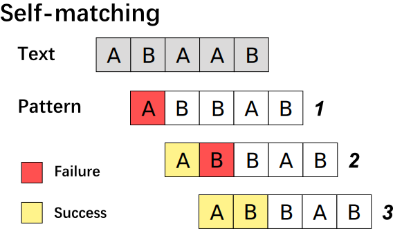

+++
title = "String Matching ①"
subtitle = "the KMP Algorithm"
summary = "A introduction to the KMP algorithm"

date = 2019-03-18T00:48:50+08:00
draft = false

authors = ["YXL"]

featured = false

tags = ["Pattern Matching"]
categories = ["Algorithm"]

[image]
  caption = ""
  focal_point = ""
  preview_only = true

[header]
  # image = "【東方】「はかなき夢ぞ命なりける」「KiTA」[pid=62341877].webp"
  image = "https://gitee.com/YXL76/academic-kickstart/raw/master/static/img/%E3%80%90%E6%9D%B1%E6%96%B9%E3%80%91%E3%80%8C%E3%81%AF%E3%81%8B%E3%81%AA%E3%81%8D%E5%A4%A2%E3%81%9E%E5%91%BD%E3%81%AA%E3%82%8A%E3%81%91%E3%82%8B%E3%80%8D%E3%80%8CKiTA%E3%80%8D%5Bpid=62341877%5D.webp"
  caption = "Image credit: [**KiTA**](https://www.pixiv.net/member_illust.php?mode=medium&illust_id=62341877)"

+++

[](https://app.netlify.com/sites/yxl/deploys)

<link rel="stylesheet" href="../../../kosugi-maru.css">
<link rel="stylesheet" href="../../../css/APlayer.min.css">
<div id="aplayer">
	<pre class="aplayer-lrc-content">
        [00:28.40]次と その次と
        [00:35.25]その次と線を引き続けた
        [00:42.47]次の目的地を描くんだ
        [00:52.76]宝島
        [00:57.53]このまま君を連れて行くと
        [01:04.29]丁寧に描くと
        [01:11.86]揺れたり震えたりした線で
        [01:18.43]丁寧に描く と決めていたよ
        [01:39.92]次も その次も
        [01:46.82]その次もまだ目的地じゃない
        [01:54.37]夢の景色を探すんだ
        [02:04.55]宝島
        [02:09.09]このまま君を連れて行くと
        [02:15.60]丁寧に歌うと
        [02:23.38]揺れたり震えたりしたって
        [02:30.12]丁寧に歌う と決めてたけど
        [03:06.60]このまま君を連れて行くよ
        [03:13.20]丁寧に描くよ
        [03:20.74]揺れたり震えたりしたって
        [03:27.40]丁寧に歌うよ
        [03:35.18]それでも君を連れて行くよ
        [03:49.56]揺れたり震えたりした線で
        [03:59.81]描くよ 君の歌を
    </pre>
</div>
<script src="../../../js/APlayer.min.js"></script>

<script>
const ap = new APlayer({
    container: document.getElementById('aplayer'),
	fixed: false,
	mini: false,
	autoplay: true,
	theme: '#b7daff',
	loop: 'all',
	order: 'list',
	preload: 'auto',
	volume: 0.8,
    audio: [{
		name: '新宝島',
		artist: 'Lefty Hand Cream',
        //url: '../../../music/新宝島-Lefty Hand Cream.mp3',
		//cover: '../../../music/新宝島-Lefty Hand Cream.jpg',
		url: 'http://pop5orv74.bkt.clouddn.com/music/%E6%96%B0%E5%AE%9D%E5%B3%B6-Lefty%20Hand%20Cream.mp3',
		cover: 'https://dev.tencent.com/u/YXL-76/p/academic-kickstart/git/raw/master/static/music/%E6%96%B0%E5%AE%9D%E5%B3%B6-Lefty%20Hand%20Cream.jpg',
		mutex: true,
		listFolded: true,
    }],
	lrcType: 2,
});
</script>

<font size=2>*This article doesn't discuss the ‘why’ of the KMP Algorithm. It only explains the implementation of the KMP algorithm in a simple way. For further study, please refer to other materials.*</font>

Firstly, let’s  look at these two codes:

``` c++
int BF()
{
    auto pattern_size = pattern.size();
    auto text_size = text.size();
    auto pattern_index = 0;
    auto text_index = 0;
    
    while (pattern_index < pattern_size && text_index < text_size)
    {
        if (pattern[pattern_index] == text[text_index])	//success
        {
            ++text_index;
            ++pattern_index;
        }
        else	//failure
        {
            text_index -= pattern_index - 1;
            pattern_index = 0;
        }
    }
    if (pattern_index == pattern_size)    return text_index - pattern_index;
    return -1;
}
```

``` c++
int KMP()
{
    auto pattern_size = pattern.size();
    auto text_size = text.size();
    auto pattern_index = 0;
    auto text_index = 0;
    
    while (pattern_index < pattern_size && text_index < text_size)
    {
        if (pattern_index == -1 || pattern[pattern_index] == text[text_index])	//success
        {
            ++text_index;
            ++pattern_index;
        }
        else    pattern_index = next[pattern_index];	//failure
    }
    if (pattern_index == pattern_size)    return text_index - pattern_index;
    return -1;
}
```

The two pieces of code above are **BF Algorithm** and **MP(KMP) Algorithm**.

By observing we can see that the two pieces of code are strikingly similar.

Let’s discover the relationship between them by simulating the process performed by the algorithm.


**BF Algorithm** is naive matching algorithm. It’s idea is to match the text string and the pattern string bit by bit from the beginning. If the match fails (mismatch), the pattern string is shifted to the right by one bit, and then matched from the beginning.

The above picture shows $13$ times matching.

It can be found that the **BF Algorithm** can be very efficient in the case of too many mismatches.


The 2 and 4 steps in the **BF Algorithm** are useless matches. Because $pattern[0] = text[0]$ and $text[0] \not= text[1]$ , therefore, $pattern[0] \not= text[1]$. The second step must match the failure, the fourth step is the same. **MP(KMP) Algorithm** in order to improve this, do not backtrack the subscript of the text string, only change the subscript of the pattern string, minus the two steps.

The above picture shows $11​$ times matching.

We get the first conclusion:

> The difference between the **MP (KMP) Algorithm** and the **BF Algorithm** is that the pattern string is shifted to the right by one bit each time the **BF Algorithm** is mismatched, and the **MP (KMP) Algorithm** is shifted to the right by $k(k \geq 1, k \in N)​$ bits.

***

Knowing the difference between **MP(KMP) Algorithm** and **BF Algorithm**, the key now is how to calculate the right-shifted $k​$ value.

Let‘s look at three more examples:


Marking that $P$ is the set of all prefixes of the pattern string, $S$ is the set of all suffixes of the pattern string, for the matched string of the example one $P = \lbrace A, AB, ABC, ABCA, ABCAB \rbrace$,$S = \lbrace B, AB, CAB, BCAB, ABCAB \rbrace$.

It can be found that the longest same element of the $P$ and $S$ of the matching string is $AB$, and the previous two matches are to move the pattern string from the prefix $AB$ to the suffix $AB$.

Since **MP(KMP) Algorithm** is traversed from left to right, we only need to record the length of the longest same element of the $P$ and $S$ of all prefix substrings of the pattern string as $l[i]$. And then, after each mismatch, the pattern string is shifted to the right by $Length-l[i-1]-1$. Marking $next[i]=l[i]$, and the **MP(KMP) Algorithm**  will come out.

So we get the second conclusion:

> **MP Algorithm**‘s right-shifted $k$ value equal to the longest same element of the $P$ and $S$ of the matched pattern string.

***

So how do you calculate $next[i]$? The answer is still coming from **MP(KMP) Algorithm**.

We match the pattern string with itself, noting that the string that matches successfully is the longest same element of the $P$ and $S$ of the corresponding substring.



Therefore, we only need to add the assignment statement to the $next$ array after matching in the **MP(KMP) Algorithm** program to complete the solution to the $next$ array. (next[0]=-1, next[i]=0, i > 0$)

``` c++
int GetNext()
{
    next[0] = -1;
    auto prefix = -1;
    auto suffix = 0;
    while (suffix < pattern_size - 1)
    {
        if (prefix == -1 || pattern[prefix] == pattern[suffix])
        {
            ++prefix;
            ++suffix;
            next[suffix] = next[prefix];	//assignment
        }
        else    prefix = next[prefix];
	}
}
```

At this point, we have completed all the code of **MP Algorithm**.

The third conclusion:

> Match the pattern string to itself to get the $next$ array.

***

Let‘s look at an example:


In this example, the second match must fail. Because $pattern[i] = pattern[next[i]]$, and $pattern[i] \not = text[i]$, therefore, $pattern[next[i]] \not = text[i]$.

So we add a judgment to the function to optimize the algorithm.

``` c++
int GetNext_KMP()
{
    next[0] = -1;
    auto prefix = -1;
    auto suffix = 0;
    while (suffix < pattern_size - 1)
    {
        if (prefix == -1 || pattern[prefix] == pattern[suffix])
        {
            ++prefix;
            ++suffix;
            if (pattern[prefix] != pattern[suffix])    next[suffix] = prefix;
            else    next[suffix] = next[prefix];
        }
        else    prefix = next[prefix];
	}
}
```

In the end, we get all the code for **KMP Algorithm**.

***

### Time Complexity

- BF Algorithm:$O(nm)​$
- MP Algorithm:$O(m)+O(n+m)$
- KMP Algorithm:$O(m)+O(n+m)$

***

- *BF Algorithm:Brute Force Algorithm*
- *MP Algorithm:Morris-Pratt Algorithm*
- *KMP Algorithm:Knuth-Morris-Pratt Algorithm*
- *[Reference Code](https://github.com/YXL76/Data-Structures-and-Algorithms/blob/master/Data%20Structures%20and%20Algorithms/include/algorithm/yxlStringAlgorithm.h)*