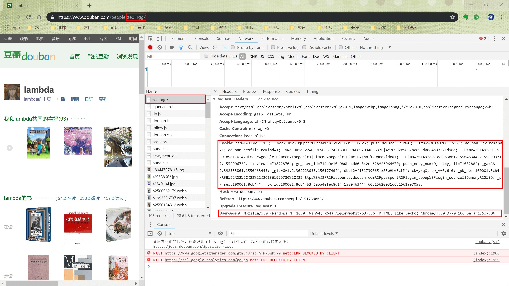
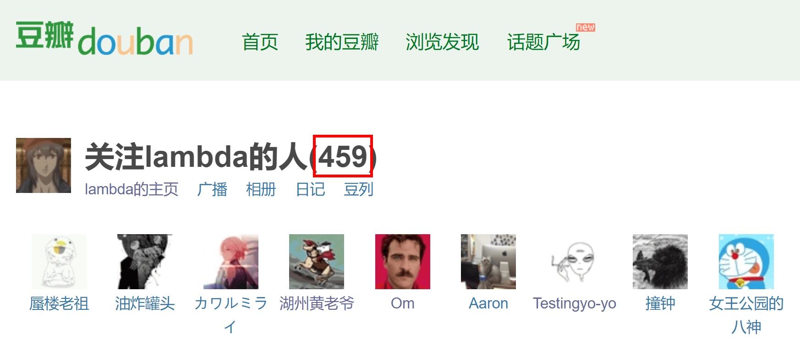
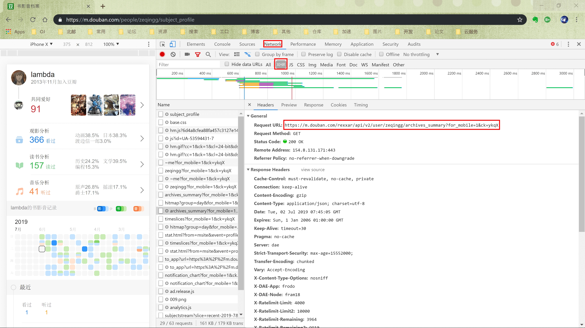
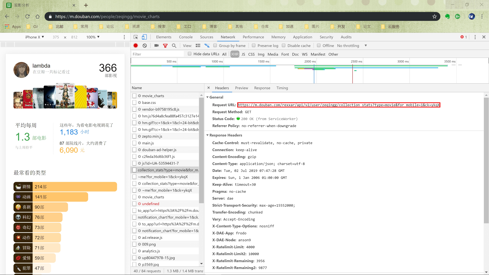
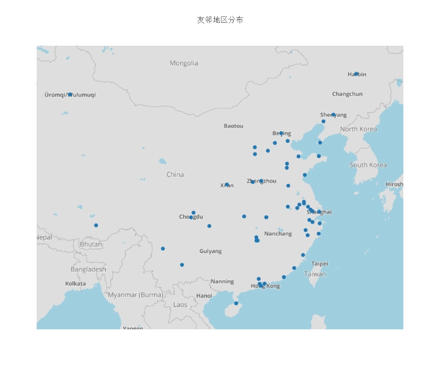
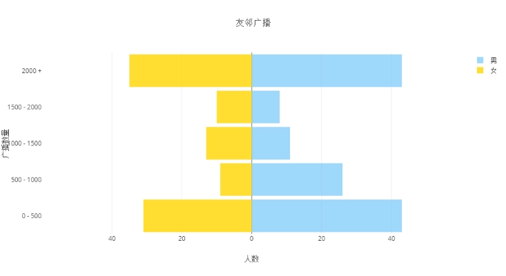
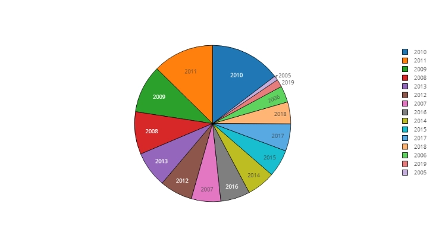
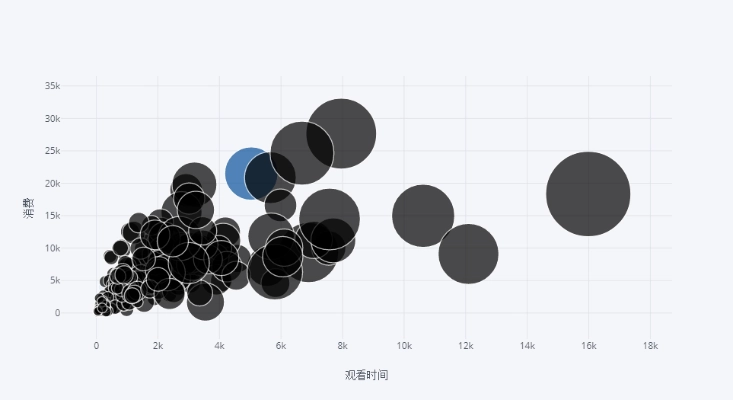
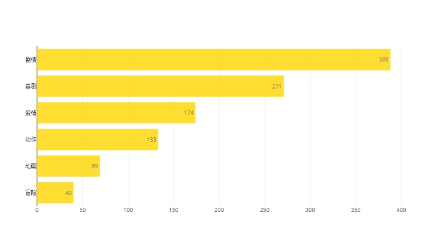
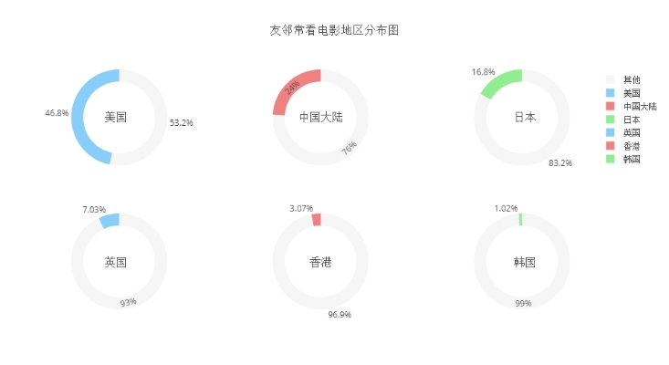

+++
title = "豆瓣友邻分析"
subtitle = ""
summary = "利用python爬虫分析豆瓣友邻数据"

date = 2019-08-19T12:21:58+08:00
draft = false

authors = ["YXL"]

featured = false

tags = ["爬虫"]
categories = ["网络"]

[image]
  caption = ""
  focal_point = ""
  preview_only = true

[header]
  image = "【初恋】「saberiii 」[pid=39758588].webp"  
  caption = "图片来源: [**saberiii**](https://www.pixiv.net/member_illust.php?mode=medium&illust_id=39758588)"
+++

[](https://app.netlify.com/sites/yxl/deploys)

{}
若手机端出现显示异常，请在菜单栏中关闭夜间模式。
{}

<div id="progress-left"></div>
<div id="progress-right"></div>

<link rel="stylesheet" href="../../../css/noto-sans-sc.css">
<link rel="stylesheet" href="../../../css/APlayer.min.css">
<script src="../../../js/APlayer.min.js"></script>
<script src="../../../js/Meting.js"></script>

<meting-js
	server = "netease"
	type = "song"
	id = "18137221"
	fixed= false
	mini= false
	autoplay = true
	preload = 'auto'
	volume = 0.8>
</meting-js>


<h2> 目录 </h2>

---

1. [简介](#Introduction)
2. [数据获取](#Data-Collection)
  1. [模拟用户登录](#Simulated-user-login)
  2. [获取目标用户友邻列表](#Get-the-target-user-neighbor-list)
  3. [获取友邻用户数据](#Get-neighbor-data)
3. [数据分析](#Data-Analysis)
  1. [绘制友邻分布地图](#Draw-a-map-of-neighboring-distribution)
  2. [绘制友邻男女广播图](#Draw-a-picture-of-your-neighbors)
  3. [绘制注册时间图](#Draw-registration-time-chart)
  4. [绘制观影数据图](#Drawing-a-viewing-data-graph)
  5. [绘制友邻常看电影类型分布图](#Draw-a-neighboring-movie-type-distribution-map)
  6. [绘制友邻常看电影地区分布图](#Draw-a-map-of-the-neighborhood-of-the-movie)
4. [总结](#Summary)

<h2 id='Introduction'> 简介 </h2>

---

这是我的一个 python 爬虫练习项目，本项目将以某一用户的友邻群体为基础，爬取相关数据并进行分析，生成对应用户的豆瓣友邻画像。

<h2 id='Data-Collection'> 数据获取 </h2>

---

<h3 id='Simulated-user-login'> 模拟用户登录 </h3>

以[https://www.douban.com/people/zeqingg/rev_contacts](https://www.douban.com/people/zeqingg/rev_contacts)为例，此页面会展示目标用户所有的友邻，其中的 `zeqingg` 即是目标用户的 `uid`。

但是需要注意的是，访问该页面必须要登录豆瓣账号，否则会跳转到登录页面，导致网页获取失败。

现在浏览器（以 `Google Chrome` 为例）中登录自己的豆瓣账号后进入此页面，使用 `Developer tools` 中的 `network` 工具获取发送给服务器的 `Cookie` 和 `User-Agent` （如下图）。在 `python` 程序中使用 `requests` 发送请求时加入 `Cookie` ，模拟登录，加入 U`ser-Agent` 模拟浏览器访问，防止被拦截，从而得到目标页面的静态文件。



``` python
import requests
from bs4 import BeautifulSoup

from settings import user_agent
from settings import cookie
from settings import target_user

session = requests.Session()

url = 'https://www.douban.com/people/' + target_user + '/rev_contacts'
headers = {
    'User-Agent': user_agent,
    'Cookie': cookie,
}

response = session.get(url=url, headers=headers)
if response.status_code != 200:
    print('获取失败，请检查cookie, uid')
soup = BeautifulSoup(response.text, 'lxml')
# print(soup)
print('获取成功')

```

所得到的 `Cookie` 并不是永久有效，并不能一直使用。倘若 `Cookie` 失效了，需要重新登录获取新的` Cookie` 。

<h3 id='Get-the-target-user-neighbor-list'> 获取目标用户友邻列表 </h3>

可以发现，每个页面最多只能显示 `70` 位友邻，而通过设置在请求的 `parameter` 中的 `start` 值来指定显示的起始友邻。因此，必须先获取目标用户的所有友邻数量。

通过对多个网页的分析，发现每位用户的友邻数都会显示在固定的地方（如下图），其对应的 `css selector` 为 `#db-usr-profile > div.info > h1` 。使用 `BeautifulSoup` 解析之前获取的网页，使用 `select` 函数提取出该部分，得到友邻数量。



``` python
# 从爬取的页面中获取用户的友邻总数

# css 选择器
num = soup.select('#db-usr-profile > div.info > h1')
num = BeautifulSoup(str(num[0]), 'lxml').string
# 数字从倒数第二个字符开始
length = len(num) - 2
while '0' <= num[length] <= '9':
    length -= 1
num = int(num[length + 1:len(num) - 1])
print(num)

```

有了友邻数量后，就可以遍历所有页面。对于每一个页面，每个友邻都有一个指向他们自己主页的链接。主页的 `url` 对应的` css selector` 都为 `#content > div > div.article > dl > dt > a`。每个url的形式如[https://www.douban.com/people/zeqingg/](https://www.douban.com/people/zeqingg/)，可以非常方便地提取出uid。

``` python
# 爬取所有友邻列表页面，获取所有友邻的 uid ，保存至本地

from settings import uid_file

with open(uid_file, 'w') as file:
    # 每页显示最多 70 个友邻
    for i in range(0, num, 70):
        current_url = url + '?start=' + str(i)
        # print(current_url)
        response = session.get(url=current_url, headers=headers)
        soup = BeautifulSoup(response.text, 'lxml')
        peoples = soup.select('#content > div > div.article > dl > dt > a')
        for people in peoples:
            uid = (BeautifulSoup(str(people), 'lxml').a['href'])[30:-1]
            print(uid)
            file.write(uid + '\n')

```

<h3 id='Get-neighbor-data'> 获取友邻用户数据 </h3>

每一个用户的主页都有其对应的数据，但是考虑到其页面结构复杂，处理起来比较复杂，且数据内容较少，所以不是使用。

豆瓣手机版的书影音档案页面就有着更加详细的信息，可以支撑更深入的数据分析。

以[https://m.douban.com/people/zeqingg/subject_profile](https://m.douban.com/people/zeqingg/subject_profile)为例，上面有许多信息可以供分析。但是获取网页后发现并没有所看到的数据。

经过分析后发现，该网页是动态网页，所有的数据都是网页打开后再请求的。再次使用 `Developer tools` 中的 `network` 工具，查看 `XHR` 类别中的项，得到了请求真正的 `url` 为[https://m.douban.com/rexxar/api/v2/user/zeqingg/archives_summary?for_mobile=1&ck=ykqX](https://m.douban.com/rexxar/api/v2/user/zeqingg/archives_summary?for_mobile=1&ck=ykqX)（如下图）。请求该链接并不需要模拟登录。同时，返回的数据为 `json` 格式，使用 `python` 中 `json` 模块的 `loads()` 函数进行解析。



需要的是账户信息，在 `json` 数据中对应的为 `user` 项，其中有许多有用的数据项，比如生日 `birthday` ，性别 `gender` ，常住地 `loc` ，注册时间 `reg_time` ，广播数 `statuses_count` 等等。我们都将其保存到一个 `csv` 文件中。

不能忽略的是，有的信息用户没有填写或不愿公开，在 `json` 中就没有对应的数据。为了防止 `python` 程序报错，使用 `try` 语句，若不存在，就写入空的字符串。

观影信息的获取同账户信息的获取一样，以手机端的网页[https://m.douban.com/people/zeqingg/movie_charts](https://m.douban.com/people/zeqingg/movie_charts)为例。此网页也为动态页面，采用和前一步相同的方法，经过分析得到了真实的请求的url为[https://m.douban.com/rexxar/api/v2/user/zeqingg/collection_stats?type=movie&for_mobile=1&ck=ykqX](https://m.douban.com/rexxar/api/v2/user/zeqingg/collection_stats?type=movie&for_mobile=1&ck=ykqX)（如下图）。



返回的 `json` 数据中有用的数据比如有观影数 `total_collections` ，观看电影电视剧的时间 `total_spent` ，在院线中的消费 `total_cost` ，平均每周观看时间 `weekly_avg` ，最常观看地区 `countries` ，最常观看类型 `genres` 等等。同样，把它们写入 `csv` 文件当中。

需要注意的是，豆瓣具有反爬虫机制，对单位时间内的访问次数有限制。如果在短时间内进行了大量访问就会被拦截。所以，使用 `python` 中 `time` 模块的 `sleep()` 函数，在每次请求后加入 `2` 秒钟的延迟，避开被拦截的可能。

``` python
from json import loads


def get_movie_info(nuid=''):
    nurl = 'https://m.douban.com/rexxar/api/v2/user/' + nuid + '/collection_stats?type=movie&for_mobile=1&ck=5Kvd'
    nreferer = 'https://m.douban.com/people/' + nuid + '/movie_charts'
    nheaders = {
        'Referer': nreferer,
        'User-Agent': user_agent,
    }
    nresponse = session.get(url=nurl, headers=nheaders)
    # 返回的数据为 json 格式，使用 loads 解析
    ndecoded = loads(nresponse.text)
    # print(decoded)
    nrow = []
    # 观影数
    try:
        nrow.append(ndecoded['total_collections'])
    except:
        nrow.append('')
    # 观看时间
    try:
        nrow.append(int(ndecoded['total_spent']))
    except:
        nrow.append('')
    # 消费
    try:
        nrow.append(int(ndecoded['total_cost']))
    except:
        nrow.append('')
    # 平均每周观看时间
    try:
        nrow.append(round(ndecoded['weekly_avg'], 1))
    except:
        nrow.append('')
    # 以下两项为最常观看地区
    try:
        nrow.append(ndecoded['countries'][0]['name'])
    except:
        nrow.append('')
    try:
        nrow.append(ndecoded['countries'][1]['name'])
    except:
        nrow.append('')
    # 以下三项为最常观看类型
    try:
        nrow.append(ndecoded['genres'][0]['name'])
    except:
        nrow.append('')
    try:
        nrow.append(ndecoded['genres'][1]['name'])
    except:
        nrow.append('')
    try:
        nrow.append(ndecoded['genres'][2]['name'])
    except:
        nrow.append('')
    # print(row)
    return nrow


def get_user_info(nuid=''):
    nurl = 'https://m.douban.com/rexxar/api/v2/user/' + nuid + '/archives_summary?for_mobile=1&ck=5Kvd'
    nreferer = 'https://m.douban.com/people/' + nuid + '/subject_profile'
    nheaders = {
        'Referer': nreferer,
        'User-Agent': user_agent,
    }
    nresponse = session.get(url=nurl, headers=nheaders)
    # 返回的数据为 json 格式，使用 loads 解析
    ndecoded = loads(nresponse.text)
    # print(decoded)
    nrow = []
    # 用户所在地区
    try:
        nrow.append(ndecoded['user']['loc']['name'])
    except:
        nrow.append('')
    # 用户广播数
    try:
        nrow.append(ndecoded['user']['statuses_count'])
    except:
        nrow.append('')
    # 用户注册时间
    try:
        nrow.append(ndecoded['user']['reg_time'][:4])
    except:
        nrow.append('')
    # 用户性别
    try:
        nrow.append(ndecoded['user']['gender'])
    except:
        nrow.append('')
    # print(row)
    return nrow


def get_info(nuid=''):
    nrow = []
    nrow += get_user_info(nuid)
    nrow += get_movie_info(nuid)
    print(nrow)
    return nrow


import csv
from time import sleep

from settings import csv_title
from settings import dataset_file

with open(uid_file) as infile:
    with open(dataset_file, 'w', encoding='utf-8', newline='') as outfile:
        csv_file = csv.writer(outfile, dialect='excel')
        csv_file.writerow(csv_title)
        for line in infile:
            uid = line[:-1]
            # print(uid)
            csv_file.writerow(get_info(uid))
            sleep(2)

```

<h2 id='Data-Analysis'> 数据分析 </h2>

---

此部分的数据可视化将以使用 `Plotly` 为例，在我所给的代码中还有使用 `pyecharts` 的版本。

<h3 id='Draw-a-map-of-neighboring-distribution'> 绘制友邻分布地图 </h3>

``` python
from settings import loc_lat
from settings import loc_lon
from settings import mapbox_access_token

# 名称
loc = []
# 人数
num = []
# 纬度
lat = []
# 经度
lon = []

with open(dataset_file, 'r', encoding='utf-8') as file:
    csv_file = csv.reader(file)
    for line in csv_file:
        # 空行（用户已注销），无数据，标题行
        if len(line) == 0 or line[0] == '' or line == csv_title:
            continue
        # 无经纬度数据
        if loc_lat.get(line[0]) is None:
            continue
        try:
            # 若此地区已加入 loc 数组
            index = loc.index(line[0])
            num[index] += 1
        except ValueError:
            # 加入新地区
            loc.append(line[0])
            num.append(1)
            lat.append(loc_lat[line[0]])
            lon.append(loc_lon[line[0]])

# print(loc)
# print(num)            

# 鼠标悬停时显示的文字
text = []
for i in range(len(loc)):
    text.append(str(loc[i]) + '   ' + str(num[i]))

data = [
    go.Scattermapbox(
        lat=lat,
        lon=lon,
        mode='markers',
        marker=go.scattermapbox.Marker(
            # 标志的大小
            size=9
        ),
        text=text,
    )
]

layout = go.Layout(
    autosize=True,
    hovermode='closest',
    height=800,
    title='友邻地区分布',
    mapbox=go.layout.Mapbox(
        # 必须要有正确的 access token 才能使用
        accesstoken=mapbox_access_token,
        bearing=0,
        center=go.layout.mapbox.Center(
            lat=34,
            lon=108
        ),
        pitch=0,
        zoom=3.5,
    ),
)

fig = go.Figure(data=data, layout=layout)
py.iplot(fig, filename='neighbor_distribution_map')


```



<h3 id='Draw-a-picture-of-your-neighbors'> 绘制友邻男女广播图 </h3>

``` python
from math import ceil
from bisect import bisect_left

from settings import status_range

# 男性人数
male_status_num = np.array(list(0 for _ in status_range))
# 女性人数
female_status_num = np.array(list(0 for _ in status_range))

with open(dataset_file, 'r', encoding='utf-8') as file:
    csv_file = csv.reader(file)
    for line in csv_file:
        # 空行（用户已注销），无数据，标题行
        if len(line) == 0 or line[1] == '' or line == csv_title:
            continue
        # 该友邻为男性
        if line[3] == 'M':
            # 查询该友邻的广播数位于哪个区间内
            index = bisect_left(status_range, int(line[1]))
            male_status_num[index - 1] += 1
        # 该友邻为女性
        elif line[3] == 'F':
            index = bisect_left(status_range, int(line[1]))
            female_status_num[index - 1] -= 1

# print(male_status_num)
# print(female_status_num)

# 最大的区间人数
length = max(max(male_status_num), -max(female_status_num))
# print(length)

# x 轴的边界设置为 30 的倍数
boundary = 30 * ceil(length / 30)
# print(boundary)

# y 轴显示的区间
label = []
for index in range(1, len(status_range)):
    label.append('{} - {}'.format(str(status_range[index - 1]), str(status_range[index])))
label.append(str(status_range[-1]) + ' +')
# print(label)

layout = go.Layout(title='友邻广播',
                   yaxis=go.layout.YAxis(title='广播数量'),
                   xaxis=go.layout.XAxis(
                       range=[-boundary, boundary],
                       # 绘图时的数值
                       tickvals=list(val for val in range(20 - boundary, boundary, 20)),
                       # 显示时的数值（正值）
                       ticktext=list(abs(text) for text in range(20 - boundary, boundary, 20)),
                       title='人数'),
                   barmode='overlay',
                   bargap=0.1)

data = [go.Bar(y=label,
               x=male_status_num,
               orientation='h',
               name='男',
               hoverinfo='x',
               marker=dict(color='lightskyblue'),
               opacity=0.8
               ),
        go.Bar(y=label,
               x=female_status_num,
               orientation='h',
               name='女',
               text=-1 * female_status_num.astype('int'),
               hoverinfo='text',
               marker=dict(color='gold'),
               opacity=0.8
               )]

py.iplot(dict(data=data, layout=layout), filename='status_pyramid_chart')

```



<h3 id='Draw-registration-time-chart'> 绘制注册时间图 </h3>

``` python
from settings import reg_year_range

reg_year_num = np.array(list(0 for _ in reg_year_range))

with open(dataset_file, 'r', encoding='utf-8') as file:
    csv_file = csv.reader(file)
    for line in csv_file:
        # 空行（用户已注销），无数据，标题行
        if len(line) == 0 or line[2] == '' or line == csv_title:
            continue
        reg_year_num[reg_year_range.index(int(line[2]))] += 1

# print(reg_year_num)

trace = go.Pie(
    labels=reg_year_range,
    values=reg_year_num,
    textinfo='label',
    marker=dict(line=dict(color='black', width=1))
)

py.iplot([trace], filename='reg_year_pie_chart')

```



<h3 id='Drawing-a-viewing-data-graph'> 绘制观影数据图 </h3>

``` python
import cufflinks as cf
import pandas as pd

cf.set_config_file(offline=False, world_readable=True)

df = pd.read_csv(dataset_file).dropna()

# x 轴：观看时间
# y 轴：消费
# 大小：观影数
df.iplot(kind='bubble', x=csv_title[5], y=csv_title[6], size=csv_title[4], text=csv_title[4],
         xTitle='观看时间', yTitle='消费', colorscale='blues', filename='movie_bubble_chart')

```



<h3 id='Draw-a-neighboring-movie-type-distribution-map'> 绘制友邻常看电影类型分布图 </h3>

``` python
from settings import genre_range

genre_num = np.array(list(0 for _ in genre_range))

with open(dataset_file, 'r', encoding='utf-8') as file:
    csv_file = csv.reader(file)
    for line in csv_file:
        # 空行（用户已注销），标题行
        if len(line) == 0 or line == csv_title:
            continue
        # 读取每位友邻最常观看的三种类型
        if line[10] != '':
            genre_num[genre_range.index(line[10])] += 1
        if line[11] != '':
            genre_num[genre_range.index(line[11])] += 1
        if line[12] != '':
            genre_num[genre_range.index(line[12])] += 1

# print(genre_num)
            
num = []
label = []
# 筛选出所有友邻最常观看的六种类型
for i in range(6):
    index = np.argmax(genre_num)
    label.append(genre_range[index])
    num.append(genre_num[index])
    genre_num[index] = 0

num.reverse()
label.reverse()

# print(num)
# print(label)

data = [go.Bar(
    x=num,
    y=label,
    text=num,
    textposition='auto',
    orientation='h',
    marker=dict(color='gold'),
    opacity=0.8
)]

py.iplot(data, filename='genre_horizontal_bar_chart')

```



<h3 id='Draw-a-map-of-the-neighborhood-of-the-movie'> 绘制友邻常看电影地区分布图 </h3>

``` python
from settings import country_range

total = 0
country_num = np.array(list(0 for _ in country_range))

with open(dataset_file, 'r', encoding='utf-8') as file:
    csv_file = csv.reader(file)
    for line in csv_file:
        # 空行（用户已注销），标题行
        if len(line) == 0 or line == csv_title:
            continue
        # 读取每位友邻最常观看的两个地区
        if line[8] != '':
            country_num[country_range.index(line[8])] += 1
            total += 1
        if line[9] != '':
            country_num[country_range.index(line[9])] += 1
            total += 1

# print(country_num)

# 饼图 x 坐标
domain_x = ([0, 0.24], [0.38, 0.62], [0.76, 1], [0, 0.24], [0.38, 0.62], [0.76, 1])
# 饼图 y 坐标
domain_y = ([0.6, 1], [0.6, 1], [0.6, 1], [0, 0.4], [0, 0.4], [0, 0.4])
colors = ('lightskyblue', 'lightcoral', 'lightgreen', 'lightskyblue', 'lightcoral', 'lightgreen')
# 文字 x 坐标
x = (0.09, 0.5, 0.91, 0.09, 0.5, 0.91)
# 文字 y 坐标
y = (0.84, 0.84, 0.84, 0.16, 0.16, 0.16)

# 绘图数据
data = []
# 饼图中央显示的文字
annotations = []
# 筛选出所有友邻最常观看的六个地区
for i in range(6):
    index = np.argmax(country_num)
    num = country_num[index]
    country_num[index] = 0

    data.append({
        'labels': [country_range[index], '其他'],
        'values': [num, total - num],
        'type': 'pie',
        'marker': {'colors': [colors[i], 'whitesmoke']},
        'domain': {'x': domain_x[i], 'y': domain_y[i]},
        'hoverinfo': 'label+percent',
        'hole': .75,
    })

    annotations.append({
        'font': {'size': 16},
        'showarrow': False,
        'text': country_range[index],
        'x': x[i],
        'y': y[i]
    })

fig = {
    'data': data,
    'layout': {
        'title': '友邻常看电影地区分布图',
        'grid': {'rows': 2, 'columns': 3},
        'annotations': annotations
    }
}

py.iplot(fig, filename='country_pie_chart')

```



<h2 id='Summary'> 总结 </h2>

---

本次的博客直接摘自我的报告，为了凑字数显得啰嗦了，还有更多的内容在我的报告中就不全部写出来了（可以在仓库中查看）。

---

- [*相关代码*](https://github.com/YXL76/Douban-Neighbor-Analysis)
- [*pyecharts*](https://pyecharts.org/)
- [*Plotly*]( https://plot.ly/python/)