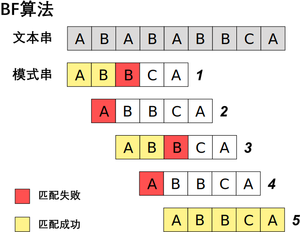
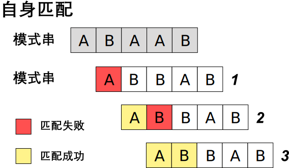

+++
title = "字符串匹配 ①"
subtitle = "KMP算法"
summary = "一个对KMP算法的介绍"

date = 2019-03-18T00:48:50+08:00
draft = false

authors = ["YXL"]

featured = false

tags = ["模式匹配"]
categories = ["算法"]

[image]
  caption = ""
  focal_point = ""
  preview_only = true

[header]
  image = "【東方】「はかなき夢ぞ命なりける」「KiTA」[pid=62341877].webp"
  caption = "Image credit: [**KiTA**](https://www.pixiv.net/member_illust.php?mode=medium&illust_id=62341877)"

+++

[](https://app.netlify.com/sites/yxl/deploys)

<font size=2>*本文不讨论KMP算法的‘所以然’，只以尽量简单的方式讲明白KMP算法的实现，若要更深层次学习请参考其他资料*</font>

我们先来看两段代码：

``` c++
int BF()
{
    auto pattern_size = pattern.size();
    auto text_size = text.size();
    auto pattern_index = 0;
    auto text_index = 0;
    
    while (pattern_index < pattern_size && text_index < text_size)
    {
        if (pattern[pattern_index] == text[text_index])	//匹配成功
        {
            ++text_index;
            ++pattern_index;
        }
        else	//匹配失败
        {
            text_index -= pattern_index - 1;
            pattern_index = 0;
        }
    }
    if (pattern_index == pattern_size)    return text_index - pattern_index;
    return -1;
}
```

``` c++
int KMP()
{
    auto pattern_size = pattern.size();
    auto text_size = text.size();
    auto pattern_index = 0;
    auto text_index = 0;
    
    while (pattern_index < pattern_size && text_index < text_size)
    {
        if (pattern_index == -1 || pattern[pattern_index] == text[text_index])	//匹配成功
        {
            ++text_index;
            ++pattern_index;
        }
        else    pattern_index = next[pattern_index];	//匹配失败
    }
    if (pattern_index == pattern_size)    return text_index - pattern_index;
    return -1;
}
```

上面的两段代码分别是**BF算法**和**MP(KMP)算法**。

通过观察我们可以发现，这两段代码惊人的相似（假装是）。

我们通过模拟算法执行的过程来发现他们之间的关系吧。



**BF算法**是朴素的匹配算法，其思想就是将文本串和模式串从头开始逐位匹配，若匹配失败（失配）则将模式串右移一位，再从头开始匹配。

上图共匹配了$13$次。

可以发现，若在失配过多的情况下，**BF算法**的效率能够非常高。


**BF算法**中的$2$、$4$步都是无用的匹配，因为$pattern[0] = text[0]$且$text[0] \not= text[1]$，所以$pattern[0] \not= text[1]$，第二步必然匹配失败，第四步同理。**MP(KMP)算法**就对此进行改进，不回溯文本串的下标，只改变模式串的下标，减去了这两步。

上图共匹配了$11​$次。

我们就得到了第一个结论：

> **MP(KMP)算法**与**BF算法**的区别在于**BF算法**每次失配后模式串仅右移一位，而**MP(KMP)算法**将右移$k(k \geq 1, k \in N)$位。

***

知道了**MP(KMP)算法**与**BF算法**的区别后，现在的关键就是如何计算右移的$k$值。

我们再看三个例子：


记$P$为模式串所有前缀的集合，$S$为模式串所有后缀的集合，对于样例一的已匹配串$P = \lbrace A, AB, ABC, ABCA, ABCAB \rbrace$，$S = \lbrace B, AB, CAB, BCAB, ABCAB \rbrace$。

可以发现，匹配串的$P$和$S$交集的最大元素为$AB​$，而前后两次匹配就是将模式串从前缀$AB​$移动到后缀$AB​$。

因为**MP(KMP)算法**是从左向右遍历，我们只需记录模式串所有前缀子串的最长前缀后缀的长度为$l[i]$，那么每一次失配后，模式串右移$Length-l[i-1]-1$位。记$next[i]=l[i]$，**MP(KMP)算法**的主程序便出来了。

于是我们就得到了第二个结论：

> **MP算法**将右移的$k$值大小等于已匹配模式串的最长前缀后缀。

***

那么如何计算$next[i]$呢？答案仍从**MP(KMP)算法**中来。

我们将模式串与自身进行匹配，注意到匹配成功的串就是对应子串的最长前缀后缀。



因此，我们只需在**MP(KMP)算法**的程序中匹配成功后增加对$next$数组的赋值语句就完成了对$next$数组的求解。（其中$next[0]=-1, next[i]=0, i > 0$）

``` c++
int GetNext()
{
    next[0] = -1;
    auto prefix = -1;
    auto suffix = 0;
    while (suffix < pattern_size - 1)
    {
        if (prefix == -1 || pattern[prefix] == pattern[suffix])
        {
            ++prefix;
            ++suffix;
            next[suffix] = next[prefix];	//赋值
        }
        else    prefix = next[prefix];
	}
}
```

至此，我们完成了**MP算法**的所有实现。

第三个结论：

> 将模式串与自身匹配即可得到$next$数组。

***

我们再来看一个例子：


在这个例子中，第二次匹配必然失败，因为$pattern[i] = pattern[next[i]]​$，而$pattern[i] \not = text[i]​$，所以$pattern[next[i]] \not = text[i]​$。

所以我们在函数中增加一次判断来优化算法。

``` c++
int GetNext_KMP()
{
    next[0] = -1;
    auto prefix = -1;
    auto suffix = 0;
    while (suffix < pattern_size - 1)
    {
        if (prefix == -1 || pattern[prefix] == pattern[suffix])
        {
            ++prefix;
            ++suffix;
            if (pattern[prefix] != pattern[suffix])    next[suffix] = prefix;
            else    next[suffix] = next[prefix];
        }
        else    prefix = next[prefix];
	}
}
```

最终我们就得到了**KMP算法**的所有代码。

***

### 时间复杂度

- BF算法：$O(nm)$
- MP算法：$O(m)+O(n+m)$
- KMP算法：$O(m)+O(n+m)$

***

- *BF算法：Brute Force算法*
- *MP算法：Morris-Pratt算法*
- *KMP算法：Knuth-Morris-Pratt算法*
- *[参考代码](https://github.com/YXL76/Data-Structures-and-Algorithms/blob/master/Data%20Structures%20and%20Algorithms/include/algorithm/yxlStringAlgorithm.h)*