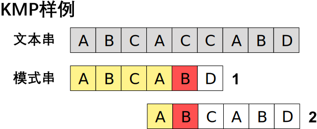

+++
title = "字符串匹配 ①"
subtitle = "KMP算法"
summary = "一个对KMP算法的介绍"

date = 2019-03-18T00:48:50+08:00
draft = false

authors = ["YXL"]

featured = false

tags = ["模式匹配"]
categories = ["算法"]

[image]
  caption = ""
  focal_point = ""
  preview_only = true

[header]
  image = "【東方】「はかなき夢ぞ命なりける」「KiTA」[pid=62341877].webp"
  caption = "图片来源： [**KiTA**](https://www.pixiv.net/member_illust.php?mode=medium&illust_id=62341877)"

+++

<font size=2>*本文不讨论KMP算法的‘所以然’，只以尽量简单的方式讲明白KMP算法的实现，若要更深层次学习请参考其他资料*</font>

我们先来看两段代码：

``` c++
int BF()
{
    auto pattern_size = pattern.size();
    auto text_size = text.size();
    auto pattern_index = 0;
    auto text_index = 0;
    
    while (pattern_index < pattern_size && text_index < text_size)
    {
        if (pattern[pattern_index] == text[text_index])
        {
            ++text_index;
            ++pattern_index;
        }
        else
        {
            text_index -= pattern_index - 1;
            pattern_index = 0;
        }
    }
    if (pattern_index == pattern_size)    return text_index - pattern_index;
    return -1;
}
```

``` c++
int KMP()
{
    auto pattern_size = pattern.size();
    auto text_size = text.size();
    auto pattern_index = 0;
    auto text_index = 0;
    
    while (pattern_index < pattern_size && text_index < text_size)
    {
        if (pattern_index == -1 || pattern[pattern_index] == text[text_index])
        {
            ++text_index;
            ++pattern_index;
        }
        else    pattern_index = next[pattern_index];
    }
    if (pattern_index == pattern_size)    return text_index - pattern_index;
    return -1;
}
```

上面的两段代码分别是**BF算法**和**KMP算法**。

通过观察我们可以发现，这两段代码惊人的相似（假装是）。

我们通过模拟算法执行的过程来发现他们之间的关系吧。


**BF算法**是朴素的匹配算法，其思想就是将文本串和模式串从头开始逐位匹配，若匹配失败（失配）则将模式串右移一位，再从头开始匹配。

上图共匹配了$13$次。

我们可以发现，若在失配过多的情况下，**BF算法**的效率能够非常高。



**BF算法**中的$2$、$4$步都是无用的匹配，因为$pattern[0] = text[0]$且$text[0] \not= text[1]$，所以$pattern[0] \not= text[1]$，第二步必然匹配失败，第四步同理。**KMP算法**就对此进行改进，不回溯文本串的下标，只改变模式串的下标，减去了这两步。

上图共匹配了$11​$次。

我们就得到了第一个重要的结论：

> **KMP算法**与**BF算法**的区别在于**BF算法**每次失配后模式串仅右移一位，而**KMP算法**将右移$k(k \geq 1, k \in N)$位

***

知道了**KMP算法**与**BF算法**的区别后，现在的关键就是如何计算右移的$k​$值。

我们再看一个例子：

``` c++
int GetNext()
{
    next[0] = -1;
    auto left = -1;
    auto right = 0;
    while (right < pattern_size - 1)
    {
        if (left == -1 || pattern[left] == pattern[right])
        {
            ++left;
            ++right;
            if (pattern[left] != pattern[right])    next[right] = left;
            else    next[right] = next[left];
        }
        else    left = next[left];
	}
}
```