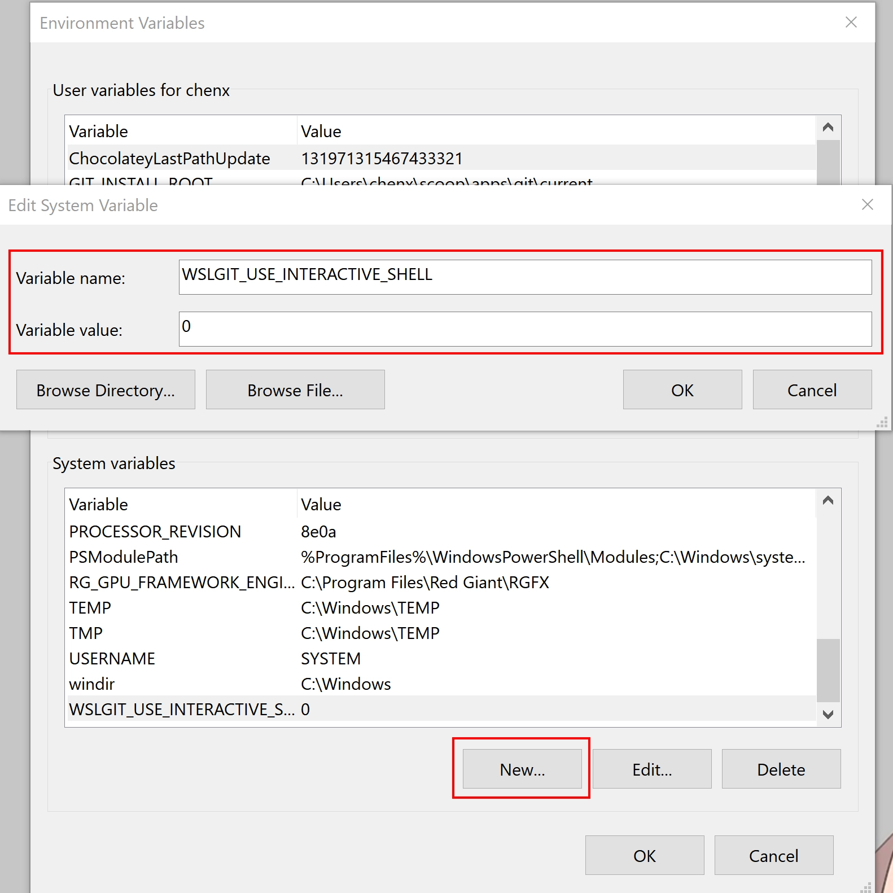
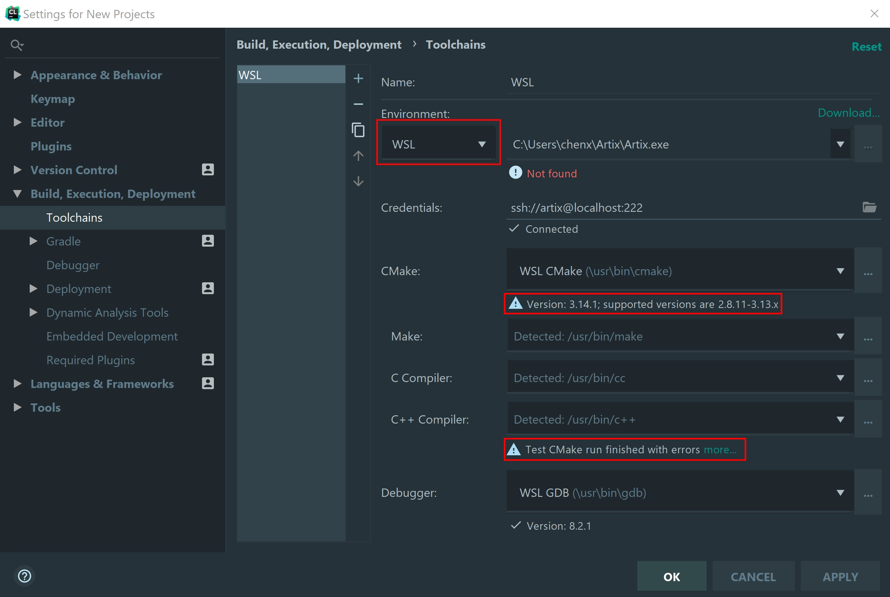
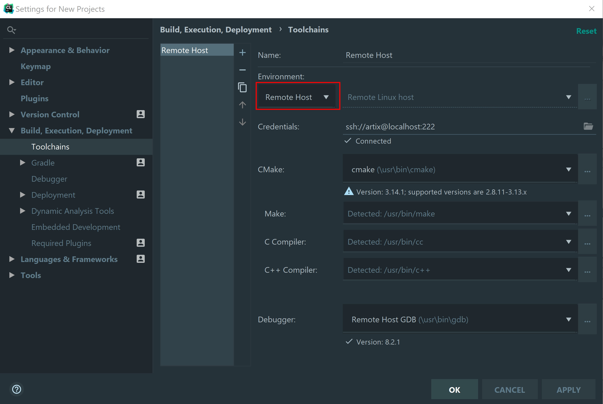

+++
title = "使用wsl搭建开发环境"
subtitle = "在 Windows 上优雅地进行开发"
summary = "总结我在配置 WSL 中得到的经验"

date = 2019-04-12T21:51:30+08:00
draft = false

authors = ["YXL"]

featured = false

tags = ["WSL"]
categories = ["系统"]

[image]
  caption = ""
  focal_point = ""
  preview_only = true

[header]
  image = "【オリジナル】「桜」「ももこ」[pid=73718366].webp"  
  caption = "图片来源: [**ももこ**](https://www.pixiv.net/member_illust.php?mode=medium&illust_id=73718366)"

+++

[](https://app.netlify.com/sites/yxl/deploys)

{}
若手机端出现显示异常，请在菜单栏中关闭夜间模式。
{}

<div id="progress-left"></div>
<div id="progress-right"></div>

<link rel="stylesheet" href="../../../css/noto-sans-sc.css">
<link rel="stylesheet" href="../../../css/APlayer.min.css">
<script src="../../../js/APlayer.min.js"></script>
<script src="../../../js/Meting.js"></script>

<meting-js
	server = "netease"
	type = "song"
	id = "27867140"
	fixed= false
	mini= false
	autoplay = true
	preload = 'auto'
	volume = 0.8>
</meting-js>

<h2> 目录 </h2>

---

1. [简介](#Introduction)
  1. [什么是 WSL ？](#What-is-WSL)
  2. [WSL 的优势是什么？](#What-are-the-advantages-of-WSL)
  3. [我都用过哪些 Linux 发行版？](#Which-linux-distributions-have-I-used)
2. [准备工作](#Preparation)
  1. [安装](#Installation)
  2. [包管理器](#Package-Manager)
  3. [终端环境](#Terminal-Environment)
  4. [ssh](#ssh)
  5. [Git](#Git)
  6. [AUR helper](#AUR-helper)
3. [使用 zsh/bash 替代 windows 终端](#Use-zsh/bash-instead-of-windows-terminal)
4. [在 Winodws 下进行开发](#Develop-under-Winodws)
  1. [环境安装](#Environmental-Installation)
  2. [VSCode](#VSCode)
  3. [Clion](#Clion)
  4. [PyCharm](#PyCharm)
5. [在 WSL 下进行开发](#Develop-under-WSL)
  1. [X Server](#X-Server)
  2. [X Client](#X-Client)
  3. [VSCode](#VSCode-2)
  4. [中文字体安装](#Chinese-Font-Installation)
  5. [Jupyter Notebook](#Jupyter-Notebook)
6. [高阶玩法](#High-Level-Operation)
  1. [ssh 连接中使用 GUI 软件](#GUI-Software-for-ssh-Connection)
  2. [桌面环境](#Desktop-Environment)
  3. [远程桌面](#Remote-Desktop)
  4. [Docker](#Docker)
7. [神一样的工具们](#Awesome-Tools)
8. [FAQ](#FAQ)
9. [总结](#Summary)

<h2 id='Introduction'> 简介 </h2>

---

<h3 id='What-is-WSL'> 什么是 WSL ？ </h3>

Windows 的 Linux 子系统（WSL）是一种新的 Windows 10 功能，使您可以直接在 Windows 上运行本机 Linux 命令行工具，以及传统的 Windows 桌面和现代商店应用程序。

<h3 id='What-are-the-advantages-of-WSL'>  WSL 的优势是什么？ </h3>

- WSL 比完整虚拟机需要更少的资源（CPU，内存和存储）。
- WSL 允许你在 Windows 命令行，桌面和商店应用程序旁边运行 Linux 命令行工具和应用程序，以及从 Linux 中访问 Windows 文件。
- Bash 的支持增强了 Windows 上命令行的价值，允许 PowerShell 利用其他流行技术。
- WSL 共享 Windows 的 IP 地址。

<h3 id='Which-linux-distributions-have-I-used'>  我都用过哪些 Linux 发行版？ </h3>

- 官方支持：
  - [Ubuntu](https://www.microsoft.com/en-us/p/ubuntu/9nblggh4msv6?activetab=pivot:overviewtab)
  - [Debian](https://www.microsoft.com/en-us/p/debian/9msvkqc78pk6?activetab=pivot:overviewtab)
  - [openSUSE Leap 42](https://www.microsoft.com/en-us/p/opensuse-leap-42/9njvjts82tjx#activetab=pivot:overviewtab)
- 社区支持：
  - [ArchWSL](https://github.com/yuk7/ArchWSL)
  - [ArtixWSL](https://github.com/hdk5/ArtixWSL)
  - [AlpineWSL](https://github.com/yuk7/AlpineWSL)

最终, 我在此教程中选择使用 `ArtixWSL` 和 `Ubuntu` 。

原因如下：

- 为什么不？
  - `Debian` ：它非常好，但是软件都太旧了。
  - `openSUSE Leap 42` ：我对它不太熟，且需要配合图形界面才比较好用。
  - `ArchWSL` ：无论是安装 `VSCode` 还是 `Atom` 都无法正常运行，根据 [issues](https://github.com/Microsoft/WSL/issues) ，这可能是由 `electron` 引起的（我不确定）。
  - `AlpineWSL` ：它更适合部署在小型设备上，不适合做开发。
- 为什么？
  - `Ubuntu` ：使用人数最多的 `WSL` ，相关教程最多，也不容易出错。（但我非常讨厌它）
  - `ArtixWSL` ：`Arch Linux` 的衍生版，可以得到差不多的使用体验，且不会出现问题。

<h2 id='Preparation'> 准备工作 </h2>

---

<h3 id='Installation'> 安装 </h3>

- [Install Windows Subsystem for Linux (WSL) on on Windows 10 | Microsoft Docs](https://docs.microsoft.com/en-us/windows/wsl/install-win10)
- [ArtixWSL/README.md](https://github.com/hdk5/ArtixWSL/blob/master/README.md)

<h3 id='Package-Manager'> 包管理器 </h3>

推荐的开源镜像站：

- [阿里巴巴开源镜像站](https://opsx.alibaba.com/mirror)
- [清华大学开源软件镜像站](https://mirrors.tuna.tsinghua.edu.cn/)

系统的路径：`%\HOMEPATH%\AppData\Local\Packages\CanonicalGroupLimited.UbuntuonWindows_79rhkp1fndgsc\LocalState\rootfs`

最好不要在 `Windows` 下修改文件，详情请看[这里](https://blogs.msdn.microsoft.com/commandline/2016/11/17/do-not-change-linux-files-using-windows-apps-and-tools/)。

- Ubuntu：

``` Bash
sudo vim /etc/apt/sources.list
# 根据开源站的提示修改文件
sudo apt-get update && sudo apt-get upgrade  # 更新
```

- Aritx：

``` Bash
vim /etc/pacman.d/mirrorlist
# 根据开源站的提示修改文件
vim /etc/pacman.conf  # 打开设置文件
# 修改 SigLevel = Never
pacman -Syu  # 更新
pacman -S base git openssh sudo binutils wget  # 安装基础组件
```

<h3 id='Terminal-Environment'> 终端环境 </h3>

安装 `zsh` 替换 `Bash`。

``` Bash
sudo apt install zsh  # Ubuntu
sudo pacman -S zsh  # Artix
sudo chsh -s $(which zsh)  # 使用 zsh 作为默认的 Shell 环境（可选）
```

安装 `oh-my-zsh` 来使终端更加美观。

``` Bash
sh -c "$(curl -fsSL https://raw.githubusercontent.com/robbyrussell/oh-my-zsh/master/tools/install.sh)"
```

关于 `oh-my-zsh` 的设置请参考[这里](https://github.com/robbyrussell/oh-my-zsh)。

你可能会发现字体并不能正常显示显示。为了字体的正常显示，我们还要进行以下操作：

1. 在资源管理器中输入`控制面板`。
2. `区域` - `管理` - `更改系统区域设置`

3. `win + r` ， 输入 `regedit` 。
4. 进入 `Computer\HKEY_CURRENT_USER\Console` 。
5. 找到你的终端，添加一个 `REG_DWORD` ，名字为 `CodePage` ，值为 `fde9` 。
6. 安装 [Powerline Fonts](https://github.com/powerline/fonts) 或 [Programmer Font](https://github.com/adobe-fonts/source-code-pro) 或 [Awesome-Powerline Fonts](https://github.com/gabrielelana/awesome-terminal-fonts) 或 [Nerd-Fonts](https://github.com/ryanoasis/nerd-fonts)。
7. 在终端中右键 - `属性` ，查看当前编码和修改字体。


<h3 id='ssh'> ssh </h3>

在 `/etc/ssh/sshd_config` 添加 `Port 222` 和 `PasswordAuthentication yes` 。

``` Bash
# 以下仅用于 Artix
sudo ssh-keygen -t dsa -f /etc/ssh/ssh_host_dsa_key
sudo ssh-keygen -t rsa -f /etc/ssh/ssh_host_rsa_key
sudo ssh-keygen -t ecdsa -f /etc/ssh/ssh_host_ecdsa_key
sudo ssh-keygen -t ed25519 -f /etc/ssh/ssh_host_ed25519_key
```

启动 `ssh` 。

``` Bash
sudo /usr/bin/sshd -D  # Artix
sudo service ssh start  # Ubuntu
```

<h3 id='Git'> Git </h3>

``` Bash
git config --global user.name "username"  # 用户名
git config --global user.email "email"  # 电子邮箱
git config --global http.proxy 'socks5://127.0.0.1:$端口号'  # HTTP 代理（可选）
git config --global https.proxy 'socks5://127.0.0.1:$端口号'  # HTTPS 代理（可选）
```

<h3 id='AUR-helper'> AUR helper </h3>

<font size=3> *以下操作仅用于 `Artix`* </font>

<font size=3> *请先安装C++环境* </font>

完整的[AUR helper列表](https://wiki.archlinux.org/index.php/AUR_helpers)，我选择的是`yay`，原因简单——它是由 `Go` 语言写成的。

`AUR helper` 并不能运行在 `root` 用户下，所以我们先创建一个新用户：

``` Bash
# 创建名为 artix 的用户
useradd -m -g users -G wheel -s /bin/bash artix
# 设置 artix 的密码
passwd artix
# 将 artix 设置为 root 用户
sudo vim /etc/sudoers
# 添加一行
artix ALL=(ALL) ALL
# 切换用户
su - artix
```

安装 `yay` 。

``` Bash
sudo chmod a+r /etc/pacman.conf
sudo chmod a+r /etc/pacman.d/mirrorlist
git clone https://aur.archlinux.org/yay.git
cd yay
makepkg -si
```

<h2 id='Use-zsh/bash-instead-of-windows-terminal'> 使用 zsh/bash 替代 windows 终端 </h2>

---

想在 `windows` 中执行  `bash` 的程序，格式如下：

``` Bash
bash -c "sudo apt-get update"
```

要想在 `bash/zsh` 中执行 `windows` 的程序，只需要在末尾加上 `.exe`。比如：

``` Bash
ipconfig.exe
```

是时候抛弃 `cmd` 和 <del>`Powershell`</del> 了。

<h2 id='Develop-under-Winodws'> 在 Winodws 下进行开发 </h2>

---

<h3 id='Environmental-Installation'> 环境安装 </h3>

- C/C++

``` Bash
sudo apt-get install build-essential cmake gcc clang gdb lldb  # Ubuntu
sudo pacman -S make cmake gcc clang gdb lldb  # Artix
```

- Python

``` Bash
sudo apt-get install python3 python3-pip  # Ubuntu
sudo apt-get install python python-pip
sudo pacman -S python python-pip python-pipenv  # Artix
sudo pacman -S python2 python2-pip python2-pipenv
```

``` Bash
# 常用包（可选）
sudo apt-get install python-scipy python-numpy python-matplotlib python-pandas  # Ubuntu
sudo pacman -S python-scipy python-numpy python-matplotlib python-pandas   # Artix
```

- Node.js

``` Bash
sudo apt-get install npm yarn nodejs  # Ubuntu
sudo pacman -S npm yarn nodejs  # Artix
```

但是我并不推荐这种安装方式，建议使用 [nvm](https://github.com/creationix/nvm#installation-and-update) 。

<h3 id='VSCode'> VSCode </h3>

- Git

使用 [WSLGit](https://github.com/andy-5/wslgit) ，我们可以在 Windows 端使用 `Git for linux` 。

下载完成后，打开 `settings.json` 。

``` json
{
  "git.path": "C:\\CHANGE\\TO\\PATH\\TO\\wslgit.exe"
}
```

在环境变量中添加一个值 `WSLGIT_USE_INTERACTIVE_SHELL` ，设其为 `0` 或 `false` 。这样在使用是将不会调用 `Shell` ，提升效率。



- C/C++

相信大部分人都使用过 `MSYS2` 、 `Cygwin` 之类的工具， WSL 的配置与之类似，只需在 `launch.json` 额外中添加管道程序和路径映射：


``` json
{
  "pipeTransport":  {
    "pipeCwd": "",
    "pipeProgram": "c:\\windows\\sysnative\\bash.exe",
    "pipeArgs": ["-c"],
    "debuggerPath": "/usr/bin/gdb"
  },
  "sourceFileMap":  {
    "/mnt/c": "c:\\"
  },
}
```

同时还要确保 `externalConsole` 的值为 `flase` ，否则将无法开启调试。


- Python

目前官方的插件正在路上： [Issue #68293](https://github.com/Microsoft/vscode/issues/68293) 。

一个可行的方案来自 [这里](http://blog.plusls.cn/windows/vscode-using-python-in-wsl/) 。

<h3 id='Clion'> Clion </h3>

`Clion 2018` 以后就能够支持 `WSL` ，若你是用的是第三方的发行版，请打开 `%\HOMEPATH%\.CLion2019.1\config\options\wsl.distributions.xml`，同时再打开注册表，进入 `Computer\HKEY_CURRENT_USER\Software\Microsoft\Windows\CurrentVersion\Lxss\` ，确保二者的 `ID` 和 `path` 相同。


并确保开启以下插件。


在 `Toolchains` 中 `Environment` 中选择 `WSL` ，开启 `ssh` 连接。


但不幸的是，如果你使用的是 `Artix` ，这种做法无效。



我们只能把 WSL 当作远程主机来使用。



两种方式的效率并无明显差别，但使用 `Remote Host` 会产生临时文件。

<h3 id='PyCharm'> PyCharm </h3>

`PyCharm` 的设置与 `Clion` 相同，修改 `%\HOMEPATH%\.PyCharm2019.1\config\options\wsl.distributions.xml` 。

在 `Project Interpreter` 中同样有两种选择。


若使用 `Remote Host` ，需要设置路径映射。


但如果你的路径中包含中文，这么做可能会报错，原因应该是它采用 `ASCII` 字符。

解决方法是在 `Development` 中设置 `Mappings` 。


<h2 id='Develop-under-WSL'> 在 WSL 下进行开发 </h2>

---

要在 WSL 下进行开发，就必须要有图形界面。虽然官方从没有正式支持 GUI 应用，但已经用无数人证明其是可行的（尽管会报大量的错）。

我们要用的是 [X Window System](https://zh.wikipedia.org/wiki/X_Window%E7%B3%BB%E7%B5%B1) 。它包含 `X Server` 和 `X Client`。

<h3 id='X-Server'> X Server </h3>

我用过的有 [Xming](https://xming.en.softonic.com/) ， [VcXsrv](https://sourceforge.net/projects/vcxsrv/) ， [MobaXterm](https://mobaxterm.mobatek.net/) ， [X410](https://www.microsoft.com/en-us/p/x410/9nlp712zmn9q?activetab=pivot:overviewtab) 。

其中体验最好的是 `X410` ，它能让我体验到近乎原生系统的流畅。官方描述如下：

> X410 utilizes the source codes from the X.Org open-source project. However, unlike other products from different companies, we've removed the dependencies on Cygwin libraries and streamlined the codes.

不过可惜的是，这是一个付费软件。我推荐先免费试用，之后再决定是否购买。

免费软件我推荐 `VcXsrv` 。

<h3 id='X-Client'> X Client </h3>

``` Bash
sudo apt-get install xorg  # Ubuntu
sudo pacman -S xorg xorg-xinit  # Artix
```

接下来就可以安装 GUI 应用了。

<h3 id='VSCode-2'> VSCode </h3>

Visual Studio Code 是我的首选项，因为我实在找不到另外一个软件可以既具有 Editor 的轻便，又具有 IDE 的强大。

``` Bash
# Ubuntu
sudo add-apt-repository ppa:ubuntu-desktop/ubuntu-make  # 添加源
sudo apt-get update  # 更新列表
sudo apt-get install ubuntu-make
umake web visual-studio-code
```

``` Bash
# Artix
# 任选一个安装即可，推荐使用 yay 安装
pacman -S code
yay -S visual-studio-code-bin
```

接下来就可以启动 `VSCode` 了。

``` Bash
DISPLAY=:0 code  # DISPLAY=localhost:0 code 的简写
sudo DISPLAY=:0 code --user-data-dir  # 以管理员身份运行，为了能够使用 git
# 你可把 DISPLAY 参数写入 .profile ，这样就不用每次都写了
echo 'export DISPLAY=:0.0' >> .profile
```

<h3 id='Chinese-Font-Installation'> 中文字体安装 </h3>

打开后发现中文显示乱码，为此我们需要安装中文字体。

`Artix` 的安装非常简单。

``` Bash
# 这是我推荐的三个字体
sudo pacman -S adobe-source-han-sans-cn-fonts
sudo pacman -S adobe-source-han-serif-cn-fonts
sudo pacman -S noto-fonts-cjk
```

`Ubuntu` 的安装就比较麻烦。一个投机取巧的做法是把 `C:\Windows\Fonts` 添加进字体目录。但在使用过程中我发现这样会影响 `Windows` 下的字体显示，甚至引起软件崩溃。

正确的做法是把字体文件移动到 `Ubuntu` 目录下，建立字体索引。可以参考[这里](https://wiki.ubuntu.com/Fonts#Manually)。

打开 VSCode 的 `settings.json` ，进行简单的配置。我的配置如下：

``` json
{
  "window.titleBarStyle": "custom",
  "editor.fontSize": 20,
  "editor.fontFamily": "'Source Code Pro', 'Source Code Pro Black', 'Source Code Pro Light', 'Source Code Pro Medium', 'Source Code Pro ExtraLigh', 'Source Code Pro Semibold'",
  "terminal.integrated.cursorBlinking": true,
  "terminal.integrated.fontFamily": "'DejaVuSansMono Nerd Font Mono', 'DejaVuSansMono Nerd Font', 'SauceCodePro Nerd Font Mono', 'SauceCodePro Nerd Font'",
  "terminal.integrated.fontSize": 16, 
}
```

其中涉及到的字体：
``` Bash
yay -S nerd-fonts-source-code-pro
yay -S nerd-fonts-dejavu-complete
# 二选一
sudo pacman -S adobe-source-code-pro-fonts
npm install git://github.com/adobe-fonts/source-code-pro.git#release
```

<h3 id='Jupyter-Notebook'> Jupyter Notebook </h3>

- 安装

``` Bash
# python3
python3 -m pip install --upgrade pip 
python3 -m pip install --upgrade pip -i https://pypi.tuna.tsinghua.edu.cn/simple  # 使用清华源
python3 -m pip install jupyter
python3 -m pip install jupyter -i https://pypi.tuna.tsinghua.edu.cn/simple  # 使用清华源
# python2
python -m pip install --upgrade pip
python -m pip install --upgrade pip -i https://pypi.tuna.tsinghua.edu.cn/simple  # 使用清华源
python -m pip install jupyter
python -m pip install jupyter -i https://pypi.tuna.tsinghua.edu.cn/simple  # 使用清华源
```

- 运行

``` Bash
jupyter notebook
sudo jupyter notebook --allow-root  # 管理员身份启动
```

之前提到过 Windows 和 WSL 共享网络端口，所以直接在 Windows 下打开 `http://localhost:8888` 。


- C/C++（可选）

<font size=3> *编译需要非常久的时间，且会占用大量空间* </font>

安装 `Cling` 。

``` Bash
wget https://raw.githubusercontent.com/root-project/cling/master/tools/packaging/cpt.py
chmod +x cpt.py
./cpt.py --check-requirements && ./cpt.py --create-dev-env Debug --with-workdir=./cling-build/
```

添加 `Cling` 内核至 `Jupyter Notebook` 。

``` Bash
export PATH=/cling-install-prefix/bin:$PATH
cd /cling-install-prefix/share/cling/Jupyter/kernel

pip3 install -e

jupyter-kernelspec install [--user] cling-cpp17
jupyter-kernelspec install [--user] cling-cpp1z
jupyter-kernelspec install [--user] cling-cpp14
jupyter-kernelspec install [--user] cling-cpp11
```

`Eclipse` 、 `Clion` 等软件也可以使用，这里不过多介绍。

<h2 id='High-Level-Operation'> 高阶玩法 </h2>

---

<h3 id='GUI-Software-for-ssh-Connection'> ssh 连接中使用 GUI 软件 </h3>

在 `/etc/ssh/sshd_config` 添加 `X11Forwarding yes` 来开启 `X Server` 。

终端以 `PuTTY` 为例。在连接的时候开启 `X11` 并设置输入端口。


<h3 id='Desktop-Environment'> 桌面环境 </h3>

既然能运行 GUI 应用，那运行桌面环境也不是问题。

我安装过的桌面环境有 `xfce4` 、 `mate` 、 `ghome` 、 `dde` ， 其中前三者表现良好，但是 `dde` 在 debian 和 Ubuntu 中都无法正常运行，一个可能的解决方案来自 [Issue #637](https://github.com/Microsoft/WSL/issues/637) 。

安装成功后就可以在终端中开启。

``` Bash
DISPLAY=:0 xfce4-session  # xfce4
DISPLAY=:0 mate-session  # mate
DISPLAY=:0 deepin-session  # dde
```

<h3 id='Remote-Desktop'> 远程桌面 </h3>

安装支持微软的远程桌面协议(RDP)的守护进程 `xrdp` 。

``` Bash
# Ubuntu
sudo apt-get install xrdp
sudo sed -i 's/port=3389/port=3390/g' /etc/xrdp/xrdp.ini  # 设置端口
sudo echo xfce4-session >~/.xsession  # 写入桌面环境
sudo service xr start  # 启动服务
```

``` Bash
# Artix
yay -S xrdp
sudo sed -i 's/port=3389/port=3390/g' /etc/xrdp/xrdp.ini  # 设置端口
sudo echo xfce4-session >~/.xsession  # 写入桌面环境
sudo usr/bin/xr  # 启动服务
```

`Win + r` 运行 `mstsc` ，就可以连接 `localhost:3390` 。

如果发生错误，请安装任意一个后端： `Xvnc` 、 `X11rdp` 、 `xorgxrdp` 。

<h3 id='Docker'> Docker </h3>

docker 目前只有客户端能运行在 WSL 上，并不能运行守护程序，网上主流的解决方法是通过 `Docker CLI` 连接到远程的守护程序上，比如 `Docker for Windows` 。但这么做仍要开启 `hyper-v` 之类的虚拟机，那么这么做并没有什么意义啊。

如果你坚持要使用，可以参考 [这里](https://nickjanetakis.com/blog/setting-up-docker-for-windows-and-wsl-to-work-flawlessly) 。

但现在已经有人成功在 WSL 上运行 `Native Docker` ，尽管功能受限，比如不能使用 `Docker Compose` ，但仍非常振奋人心。

我只在 `Ubuntu` 上尝试并成功了：


以管理员身份打开 `Ubuntu.exe` 。

``` Bash
sudo apt-get remove docker docker-engine docker.io containerd runc # 卸载旧版本
sudo apt-get update  # 更新列表

# 允许 apt 通过 HTTPS 使用存储库
sudo apt-get install \
    apt-transport-https \
    ca-certificates \
    curl \
    gnupg-agent \
    software-properties-common

# 添加 Docker 的GPG密钥
# 链接可替换为清华源：https://mirrors.tuna.tsinghua.edu.cn/docker-ce/linux/ubuntu/gpg
curl -fsSL https://download.docker.com/linux/ubuntu/gpg | sudo apt-key add -

# 设置稳定存储库
# 链接可替换为清华源：https://mirrors.tuna.tsinghua.edu.cn/docker-ce/linux/ubuntu/
sudo add-apt-repository \
    "deb [arch=amd64] https://download.docker.com/linux/ubuntu \
    $(lsb_release -cs) \
    stable"
  
sudo apt-get update
sudo apt-get install docker-ce
sudo service docker start  # 开启 docker
```

开启后若出现 `Cannot connect to the Docker daemon ... Is the docker daemon running?` ，请参考 [Issue #2291](https://github.com/Microsoft/WSL/issues/2291#issuecomment-383698720) 。


<h2 id='Awesome-Tools'> 神一样的工具们 </h2>

---

- [wsl-open](https://github.com/4U6U57/wsl-open) ： 使用它能够在 WSL 中用 Windows 文件资源管理器打开文件/文件夹。
- [wslu](https://github.com/wslutilities/wslu) ： WSL 的一组实用程序。
- [Ansible-WSL](https://github.com/Wintus/Ansible-WSL) ： 通过 WSL 给 Windows 提供 Ansible 。
- [wsl-terminal](https://github.com/goreliu/wsl-terminal) ： 用于 WSL 的终端模拟器。
- [LxRunOffline](https://github.com/DDoSolitary/LxRunOffline) ： 用于管理 WSL 的全功能实用程序。

这里我特别提一下 `LxRunOffline` 。这东西绝对是使用 WSL 的必备工具，备份功能能让你尽情折腾，还能防止像 Arch 之类滚动更新的系统滚挂了。

<h2 id='FAQ'> FAQ </h2>

---

**Q ：WSL GUI 应用全屏后不能直接切换到 windows 应用窗口。**

A ：没有办法解决，但是可以建立一个新的桌面专门用于 `WSL` ，不同桌面之间切换的快捷键为 `Win + Ctrl + ←` 和 `Win + Ctrl + →` 。

**Q ：如何设置 WSL 的默认发行版？**

A ：在 Powershell 中执行 `wslconfig` 。你不仅可以设置默认发行版，还可以删除发行版，更改默认用户。比如：

``` Bash
wslconfig /l  # 列出所有发行版
wslconfig /u ubuntu   # 删除 ubuntu
wslconfig /s ubuntu   # 设置 ubuntu 为默认 WSL
wslconfig ubuntu config --default-user root   # 设置 ubuntu 的默认用户为 root
```

**Q ：为什么 WSL 的 CPU 资源占用率特别高？**

A ：这很大程度上是由 `Windows Defender` 引起的，你可以关闭它，或者把 WSL 目录加入白名单。

**Q ：为什么有些 windows 程序无法在 bash 中打开？**

A ：默认只能够打开 `C:\Windows\System32` 的程序，若要打开其他程序，请写入 `~/.profile`。举个例子： `export PATH="$PATH:/mnt/c/Program Files/PreSonus/Studio One 4/"` 。 

**Q ：GUI 应用在高分屏下文字过小。**

A ：最简单的解决方法是在 windows 下设置 `X Server` 的缩放行为。但这样的字体往往会发虚。

第二种方法是在输出前执行以下指令：

``` Bash
export QT_SCALE_FACTOR=2  # 针对 ≥ Qt 5.6 应用，缩放 200%
export GDK_SCALE=2  # 针对 GDK 3 (GTK+ 3) 应用，缩放 200%
```

第三种方法是针对像 `VSCode` 、 `Atom` 这样由 `electron` 开发的应用，可以直接设置 `"window.zoomLevel": 4` 。

第四种方法建立在你已安装了桌面环境，在 `Appearance` - `custom DPI setting` 中设置 DPI 大小。


**Q ：如何改变 WSL 的显示语言？**

A ：这是一个例子：

``` Bash
sudo update-locale LANG=en_US.UTF8
```

<h2 id='Summary'> 总结 </h2>

---

WSL 让 windows 下的开发更舒服。但许多的问题导致它不能够取代虚拟机或者 Docker，比如 [不支持OpenCL & CUDA](https://wpdev.uservoice.com/forums/266908-command-prompt-console-windows-subsystem-for-l/suggestions/16108045-opencl-cuda-gpu-support)，不能够使用完整的 `Native Docker` 以及糟糕的 `I/O` 性能。

而且 WSL(Linux) 这东西需要折腾，得经过多次失败才能找到合适的。

像极了爱情。

---

- [*Microsoft/WSL: Issues found on WSL*](https://github.com/microsoft/wsl)
- [*Windows developer feedback site*](https://wpdev.uservoice.com/forums/266908-command-prompt-console-windows-subsystem-for-l)